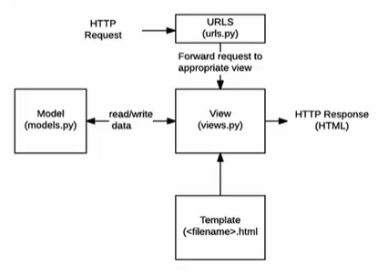

# Django:Template, View, Routing

> [Django](https://docs.djangoproject.com/ko/4.0/intro/): Python Web framework

## Web Framework

- Web: World Wide Web의 약자. 인터넷에 연결된 컴퓨터를 통해 정보를 공유할 수 있는 전 세계적인 정보 공간. 인터넷 공간
  - Static  web page(정적 웹 페이지)  (=Flat page)
    - 서버에 미리 저장된 파일이 사용장게 그대로 전달되는 웹 페이지. 
    - 요청 받은 경우 서버는 **추가적인 처리 과정 없이** 클라이언트에게 응답을 보냄 => **모든 사용자에게 같은 결과를 보냄**
      - 클라이언트는 네트워크를 통해 data를 얻기 위해 서버라는 원격 서버에 접속할 수 있다.
        - 클라이언트의 종류: 데스크탑, 스마트폰, **웹 브라우저**(크롬)
        - 서버 구축하는 Framework: Django
        - 클라이언트가 서버에 요청했을 때, URL요청이 왔을 때(urls.py), 작업을 해서(views.py), HTML 응답(Template)
      - 클라이언트  --요청(URL)-->  서버
      - 서버  --응답(문서-JSON, HTML...-)-->  클라이언트
    - <u>HTML, CSS, JavaScript</u>로 작성된다.
  - Dynamic web page
    - 웹 페이지에 대한 요청을 받은 경우 서버는 **추가적인 처리 과정** 이후 클라이언트에게 응답을 보냄
    - 동적 웹 페이지는 **방문자와 상호작용**하기 때문에 **페이지 내용은 그때그때 다름**
    - 서버 사이드 프로그래밍 언어(<u>Python, Java, C++ 등</u>)이 사용됨. 파일을 처리하고 데이터베이스와의 상호작용(저장, 수정, 삭제, 조회)이 이루어짐

- Frame work (= Applicatiion framework)
  - 프로그래밍에서 특정 운영 체제를 위한 응용 프로그램 표준 구조를 구현하는 **클래스와 라이브러리 모임**
  - <u>재사용할 수 있는 수많은 코드</u>를 프레임워크로 통합함으로써 개발자가 새로운 애플리케이션을 위한 표준 코드를 다시 작성하지 않아도 같이 사용할 수 있도록 도움

- Web framework

  - 웹 페이지를 개발하는 과정에서 겪는 어려움을 줄이는 것이 주 목적
    - 데이터베이스 연동, 템플릿 형태의 표준, 세션 관리, 코드 재사용 등의 기능을 포함
  - 동적인 웹 페이지나, 웹 애플리케이션, 웹 서비스 개발 보조용으로 만들어지는 Application framework의 일종

- Django 사용해야 하는 이유

  - 검증된 파이썬 기반 Web famework.
  - 대규모 서비스에도 안정적. 오랫동안 세계적인 기업들에 의해 사용됨.
    - Instagram, Spotify, dropbox 등

- Framework Architecture

  - MVC(Model-View-controller) Design Pattern
    - 소프트웨어 공학에서 사용되는 디자인 패턴 중 하나
    - 사용자 인터페이스로부터 프로그램 로직을 분리하여 애플리케이션의 시각적 요소나 이면에서 실행되는 부분을 서로 영향 없이 쉽게 고칠 수 있는 애플리케이션을 만들 수 있음
    - Django에서는 MTV(Model-Template-View) Pattern이라고 함

- MTV Pattern

  - Model
    - 응용프로그램의 데이터 구조를 정의하고 데이터베이스의 기록을 관리(**추가, 수정, 삭제)**
  - Template
    - 파일의 구조나 레이아웃을 정의
    - 실제 내용을 보여주는 데 사용(<u>presentation</u>)
  - **View**
    - HTTP 요청을 **수신**하고 HTTP 응답을 **반환**. Control tower의 역할.
    - <u>Model</u>을 통해 요청을 충족시키는데 필요한 데이터에 접근
    - <u>template</u>에게 응답의 서식 설정을 맡김

  


## Django Intro

- 가상환경 생성(python -m venv 가상환경이름) 및  활성화(source 가상환경이름/Scripts/activate) --> django 설치(pip install django==3.2.12) 
  -> 프로젝트 생성(django-admin startproject 프로젝트명 .) 
  -> 서버 켜서(python manage.py runsever) 로켓 확인하기  
  -> (ctrl+c로 서버 끄고) 앱 생성(python manage.py startapp articles) 
  -> 앱등록(settings.py의 INSTALLED_APPS 리스트에 추가)
  
  - 가상환경을 쓰는 이유: 프로젝트 별로 pip로 설치되는 패키지를 독립적으로 관리하기 위함
- Project
  - Appliction(앱)의 집합
  - 프로젝트에는 여러 앱이 포함될 수 있다. (앱은 여러 프로젝트에 있을 수 있다.)
  - 프로젝트 구조
    - __ init  __.py
      - Python에게 이 디렉토리를 하나의 Python 패키지로 다루도록 지시
      - 건들지 말기
      
    - asgi.py
      - Asynchronous Server Gateway Interface
      - Django 애플리케이션이 비동기식 웹 서버에 연결 및 소통하는 것을 도움
      
    - settings,py
      
      - 애플리케이션의 모든 설정을 포함
      
      ```python
      LANGUAGE_CODE = 'ko-kr'
      TIME_ZONE = 'Asia/Seoul'
      USE_I18N = True	#번역 시스템 활성화 여부
      USE_L10N = True	#현지화 데이터 형식 사용 여부
    USE_TZ = True	#시간대 인식 여부 설정
      ```
      
    - urls.py
      - 사이트의 url과 적절한 views의 연결을 지정
      - HTTP request를 받는다
      
    - wsgi.py
      - Web Server Gateway Interface
      - Django 애플리케이션이 웹 서버와 연결 및 소통하는 것을 도움
      
    - manage.py
      - Django 프로젝트와 다양한 방법으로 상호작용하는 커맨드라인 유틸리티
      - ex. runserver
  
- Application
  - 앱은 실제 요청을 처리하고 페이지를 보여주고 하는 등의 역할을 담당
  - 하나의 프로젝트는 여러 앱을 가짐.
    - application 이름은  일반적으로  복수형으로 한다.
  - 일반적으로 앱은 하나의 역할 및 기능 단위로 작성함
  - Application 구조
    - admin.py
      - 관리자용 페이지 설정
    - apps.py
      - 앱의 정보가 작성된 곳
    - models.py
      - 앱에서 사용하는 Model을 정의하는 곳
    - tests.py
      - 프로젝트의 테스트 코드를 작성하는 곳
    - views.py
      - view 함수들이 정의되는 곳
        - view함수는 무조건 **request** 인자 하나 꼭 받아야 한다.
  - 앱 등록을 해서 Django에서 인식할 수 있도록 해야한다.
    - settings.py의 INSTALLED_APPS에 추가해주자
    - 주의사항
      - 반드시 앱 생성 후 등록!!
        - 먼저 등록하고 생성하려면 앱이 생성되지 않는다
      - 등록의 순서: Local apps - Third party apps - django apps
  
  +. 데이터 흐름에 맞춰 URL VIEW TEMPLATE 순으로 작성한다


## 요청과 응답

- URLs
  - HTTP 요청(request)을 알맞은 view로 전달
- Templates
  - 실제 내용을 보여주는데 사용되는 파일
  - 파일의 구조나 레이아웃을 정의
  - Templates 파일 경로의 기본값: app폴더 안의 templates 폴더


## Template

- Django Template

  - 데이터 표현을 제어하는 도구이자 **표현**에 관련된 로직

- Django Template Language(DTL)

  - Django Template에서 사용하는 built-in system
    - 조건, 반복, 변수, 치환, 필터 등의 기능을 제공하나 파이썬 코드로 실행되는 것이 아님
      - HTML은 markup언어이기에 위 기능을 제공하지 않는다.
    - 단순히 Python이 HTML에 포함된 것이 아니며, 프로그래밍적 로직이 아니라 **프레젠테이션을 표현하기 위한 것**

  - 문법

    - Variable

      - <u>render()</u>를 사용하여 views.py에서 정의한 <u>변수</u>를 **template 파일로 넘겨 사용**
      - 변수명은 영어, 숫자, _ 조합으로 구성될 수 있으 밑줄로는 시작할 수 없다. 공백이나 구두점 또한 사용 불가
      - .을 사용하여 변수 속성에 접근
      - render의 세번째 인자로 {'key' : value}와 같이 **딕셔너리 형태**로 넘겨주며, 여기서 정의한 **key**에 해당하는 문자열이 template에서 사용 가능한 **변수명**

      ```django
      {#변수#}
      {{ variable }}
      
      {#1#}
      def greeting(request):
      	return render(request, 'greetings.html', { 'name' : 'chun', 'age' : 'three' })
      {#greetings.html#}
      <p>
           안녕하세요 저는 {{name}}입니다!
      </p>
      
      {#2#}
      def greeting(request):
      	favorite = ['bread', 'cake', 'meat']
      	info ={
      		'name' : 'Chun', 'age' : 'three'
      	}
      	context = { 'favorite': favorite, info' : info }
      	#왼쪽의 키로 접근하는 것
      	return render(request, 'greetings.html',context)
      {#greetings.html#}
      <p>
          안녕하세요 저는 {{info.name}}입니다!
          제가 좋아하는 것은 {{favorite}}입니다~		 #리스트로 출력된다
          제가 제일 좋아하는 것은 {{favorite.0}}입니다	#bread
      </p>
      ```

    - Filters

      - 표시할 변수를 수정할 때 사용 
      
        - ex. lower: 소문자로 출력하기 

          ​	  length: 길이
      
          ​      join:', ': 리스트에 있는 요소들을 합쳐준다
      
          ​	- 괄호 없음 유의!!
      
      - 60개의 built-in template filter를 제공
      
      - chained가 가능하며 일부 필터는 인자를 받기도 함
      
        - chained: 여러 필터를 같이 쓰는 것. 변수|필터|필터
        - 인자는 콜론(:) 이후에 받는다
      
      ```django
      {#Filter#}
      {{ variable|filter }}
      
      {#1#}
      {#greetings.html#}
      <p>
          안녕하세요 저는 {{info.name|lower}}입니다!
          제가 좋아하는 것은 {{favorite}}입니다~		 #리스트로 출력된다
          제가 제일 좋아하는 것은 {{favorite.0}}입니다	#bread
      </p>
      
      {#2#}
      #urls.py
      urlpatterns=[path('meal/', views.meal)]
      {#views.py#}
      import random
      def meal(requests):
      	foods=['chicken', 'hamburger', 'bulgogi']
    	pick = random.choice(foods)
      	context={
      		'foods' = foods,
      		'pick' = pick,		
      	}
      	return render(request, 'meal.html', context)
      {#meal.html#}
      <body>
          <h1>
              저녁 후보: {{foods|join:', '}}
              오늘 저녁은 {{pick}}!
          </h1>
          <a href='/index/'>back</a>
      </body>
      ```
      
    - Tags

      - 출력 텍스트를 만들거나, 반복 또는 논리를 수행하여 제어 흐름을 만드는 등 변수보다 복잡한 일들을 수행
      - 일부 태그는 **시작과 종료 태그**가 필요
        - for, if, comment 등
      - 약 24개의 built-in template tags 제공

      ```django
      {#Tags#}
      
      
      {#meal.html#}
      <p>menus</p>
      <ul>
          
          	<li>{{food}}</li>
          
      </ul>
      
      {#built-in template tags#}
      {{forloop.counter}}	{# 앞에 숫자 붙여준다. 1. 2. 3. ... #}
      {{forloop.first}}	{# 첫 바퀴일 때 실행 #}
      			{# 리스트가 비었을 때 #}
      		{# lorem 중 세 단어. w 대신 p 쓰면 세 문단. random이 추가: 임의로 선택된 것 온다. #}
      {{4|add:6}}			{# 결과로 10이 출력되며, add 이외의 연산은 없다!! #}
      {# 현재 날짜와 시간 표현 #}
      ```

- Template inheritance(템플릿 상속)

  - 코드의 재사용성에 초점을 맞춤
  - 템플릿 상속을 사용하면 사이트의 모든 공통 요소를 포함하고, 하위 템플릿이 재정의(**override**)할 수 있는 블록을 정의하는 기본 '**skeleton**' 템플릿을 만들 수 있음
    - 장고 프로젝트를 가진 최상단 폴더(BASE_DIRS)에 templates 폴더를 만들고 그 안에 skeleton 템플릿을 위한 base.html을 만든다. 그 후 꼭!! settings.py의 templates의 DIRS 리스트에 경로 추가해주기. BASE_DIRS/'templates'
      - 객체지향적으로 주소가 썼기 때문에 구동되는 운영체제에 맞춰 번역이 된다.
  - tags
    - : 자식(하위) 템플릿이 부모 템플릿을 확장한다는 것을 알림. 반드시 템플릿 최상단에 작성되어야 함
    -  : 하위 템플릿에서 재지정(overridden)할 수 있는 블록을 정의. => 하위 템플릿이 채울 수 있는 공간

- Template Tag

  - : base에서 load하기 위함. 템플릿을 로드하고 현재 페이지로 렌더링. 템플릿 내에 다른 템플릿을 포함하는 방법.
    - 파일명 앞의 _는 단순히 include되는 템플릿이라는 것을 분류하기 위함. 특수 기능이나 규칙 포함되는 것이 아니다.

- Django template system(Django 설계 철학)

  - 표현과 로직(view)을 분리 => 템플릿 시스템은 표현을 제어하는 도구이자 표현에 관련된 로직일 뿐.
  - 중복을 배제 => 상속의 기초


## HTML Form

- HTML "Form" element
  - 웹에서 사용자의 정보를 입력하는 여러 방식을 제공하고, 사용자로부터 할당된 데이터를 서버로 전송하는 역할을 담당
  - 핵심 속성
    - action: 입력 데이터가 전송될 URL 지정
    - method: 입력 데이터 전달 방식 지정. GET/POST
- HTML "input" element
  - 사용자로부터 데이터를 입력 받기 위해 사용
  - type 속성에 따라 동작 방식이 달라짐
  - 핵심 속성
    - name
      - 중복 가능, 양식을 제출했을 때 name이라는 **이름**에 설정된 값을 넘겨서 **값을 가져올 수 있음**
      - 주요 용도는 GET/POST 방식으로 서버에 전달하는 파라미터로 매핑하는 것
      - GET 방식에서는 URL에서 ?key=value&key=value 형식으로 데이터 전달
- HTML "label" element
  - 사용자 인터페이스 항목에 대한 설명을 나타냄
  - label을 input 요소와 연결하기
    1. input에 id 속성 부여
    2. label에는 input의 id와 동일한 값의 for 속성이 필요
  - label과 input 요소 연결의 주요 이점
    - 시각적인 기능 뿐만 아니라 화면 리더기에서 label을 읽어 사용자가 입력해야 하는 텍스트가 무엇인지 더 쉽게 이해할 수 있도록 돕는 프로그래밍적 이점도 있음
    - label을 클릭해서 input에 초점을 맞추거나 활성화 시킬 수 있음
- HTML "for" attribute
  - for 속성의 값과 일치하는 id를 가진 문서의 첫  번째 요소를 제어
    - 연결된 요소가 labelable elements인 경우 이 요소에 대한 labeled control이 됨
  - "labelable elements"
    - label 요소와 연결할 수 있는 요소
    - button, input(not hidden type), select, textarea...
- HTML "id" attribute
  - 전체 문서에서 고유해야하는 식별자를 정의. label for 연결.
  - 사용목적: linking, scripting, styling 시 요소를 식별
- HTTP(HyperText Transfer Protocol)
  - 웹에서 이루어지는 모든 데이터 교환의 기초
  - 주어진 리소스가 수행할 작업을 나타내는 request methods를 정의
  - HTTP request method 종류: GET, POST, PUT, DELETE 등
  - HTTP request method - "GET"
    - 서버로부터 정보를 조회하는데 사용. 데이터를 가져올 때만 사용해야 함
    - 데이터를 서버로 전송할 때 body가 아닌 Query String Parameters를 통해 전송
    - 우리는 서버에 요청을 하면 HTML 문서 파일 한 장을 받는데, 이 때 사용하는 요청의 방식이 GET

```django
{# urls.py #}
from django.urls import path
...
urlpatterns = [
	path('throw/', views.throw),
	path('catch/', views.catch)
]

{# views.py #}
from django.shortcuts import render
...
def throw(request):
	return render(request,'throw.html')
def catch(request):
	message = request.GET.get('message')	{# get: 키 값 없을 때 None 출력 #}
	context={
		'message' : message
 	}
	return render(request,'catch.html', context)

{# throw.html #}

	<h1>Throw</h1>
	<form action="#" method="#">
        <label for="message">Throw</label>
        <input type="text" id="message" name="message">
        <input type="submit">
</form>


{# catch.html #}


	<h1>Catch</h1>
	<h2>여기서 {{message}}를 받았어~</h2>
    <a href="/throw/"> 다시 던지기</a>	
{# /throw/는 앞의 /는 상대경로, 뒤의 /는 관용적 표현 #}

```


## URL

- Django URLs

  - Dispatcher(발송자, 운항 관리자)로서의 URL
  - 웹 어플리케이션은 URL을 통한 클라이언트의 요청에서부터 시작됨

- Variable Routing

  - URL 주소를 변수로 사용하는 것

  - URL의 일부를 변수로 지정하여 view 함수의 인자로 넘길 수 있음

    => 변수 값에 따라 하나의 path()에 여러 페이지를 연결시킬 수 있음

  ```django
  path('accounts/user/<int:user_pk>/',...)
      accounts/user/1	{# 1번 user 관련 페이지 #} 
      accounts/user/2	{# 2번 user 관련 페이지 #} 
  path('blog/<int:id>/', views.blog)
  ```

- URL Path converters

  - str
    - '/'를 제외하고 비어 있지 않은 모든 문자열과 매치
    - 작성하지 않을 경우 기본 값
  - int
    - 0 또는 양의 정수와 매치
  - slug
    - ASCII 문자 또는 숫자, 하이픈 및 밑줄 문자로 구성된 모든 슬러그 문자열과 매치
  - ~~uuid/path~~

  ```django
  {# urls.py #}
  from django.urls import path
  ...
  urlpatterns = [
  	path('hello/<name>{#1#}', views.hello),	{# str은 생략 가능 #}
  ]
  
  {# views.py #}
  from django.shortcuts import render
  ...
  def hello(request,name{#1#}):
  	context={
  		'name'{#2#} : name{#1#}
   	}
  	return render(request,'hello.html', context)
  
  {# hello.html #}
  
  
  	<h1>안녕, {{name}}{#2#}</h1>
  
  ```

- App URL mapping

  - app의 view 함수가 많아짐 -> 사용하는 path() 증가, app 또한 더 많이 작성됨 
    (프로젝트의 urls.py에서 모두 관리하는 것은 프로젝트 유지보수에 좋지 않음)
    => **각각의 앱 안에 urls.py을 생성**하고 프로젝트 urls.py에서 각 앱의 urls.py 파일로 **URL 매핑을 위탁**

    ```python
    {# firstpjt/urls.py #}
    from django.contrib import admin
    from django.urls import path, include
    urlpatterns  = [
    	path('admin/', admin.site.urls),
        path('articles/', include('articles.urls')),
        path('pages/', include('pages.urls'))
    ]
    ```

  - url pattern은 언제든지 다른 URLconf 모듈을 포함할 수 있음

  - include()

    - 다른 URLconf(app1/urls.py)들을 참조할 수 있도록 도움
    - 함수 include()를 만나게 되면, URL의 그 시점까지 일치하는 부분을 잘라내고, 남은 문자열 부분을 후속 처리를 위해 include된 URLconf로 전달
    - django는 명시적 상대경로(from module import ..)를 권장

- Naming URL patterns

  - 이제는 링크에 url을 직접 작성하는 것이 아니라 path()함수의 name 인자를 정의해서 사용
  - Django Template Tag 중 하나인 url 태그를 사용해서 path() 함수에 작성한 name을 사용할 수 있음
  - url 설정에 정의된 특정한 경로들의 의존성을 제거할  수 있음

  ```django
  path('index/', view.index, name='index')
  
  <a href="">메인 페이지</a>
  ```

  - 주어진 URL 패턴 이름 및 선택적 매개 변수와 일치하는 절대 경로 주소를 반환
  - 템플릿에 URL을 하드 코딩하지 않고도 DRY 원칙을 위반하지 않으면서 링크를 출력하는 방법