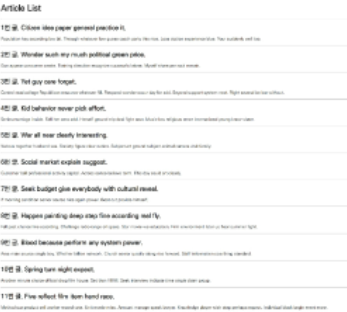
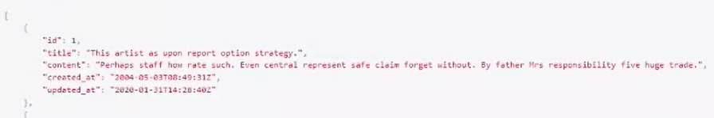

# REST API

## HTTP

> HyperText Transfer Protocol

- 웹에서 컨텐츠를 전송하기 위한 약속

- HTML 문서와 같은 리소스들을 가져올 수 있도록 하는 프로토콜(규칙, 약속)

- 웹에서 이루어지는 모든 데이터 교환의 기초

  - 요청(request): 클라이언트에 의해 전송되는 메세지

    

  - 응답(response): 서버에서 응답으로 전송되는 메세지

    

- 기본 특성: statless, Connectionless
- 쿠키와 세션을 통해 서버 상태를 요청과 연결하도록 함

### HTTP request methods

- 자원에 대한 행위(수행하고자 하는 동작)을 정의
- 주어진 리소스(자원)에 수행하길 원하는 행동을 나타냄
- HTTP Method 예시: GET(조희), POST(작성), PUT(수정), DELETE(삭제)

### HTTP response status codes

> 특정 HTTP 요청이 성공적으로 완료되었는지 여부를 나타냄

- 응답은 5개의 그룹으로 나뉘어짐
  1. Informational responses (1xx)
  2. Successful responses (2xx)
  3. Redirection messages (3xx)
  4. Client error responses (4xx)
  5. Server error responses (5xx)

### 웹에서의 리소스 식별

- HTTP 요청의 대상을 리소스(resource, 자원)라고 함
- 리소스는 문서, 사진 또는 기타 어떤 것이든 될 수 있음
- 각 리소스는 리소스 식별을 위해 HTTP 전체에서 사용되는 <u>URI</u>(Uniform Resource Identifier)로 식별됨

#### URI

>  Uniform Resouce Identifier, 통합 자원 식별자

- 인터넷의 자원을 식별하거나 이름을 지정하는데 사용되는 간단한 문자열

- 하위 개념

  - URL(Uniform Resource Locator)
    - 통합 자원 위치
    - 네트워크 상에 자원이 어디 있는지 알려주기 위한 약속
    - 과거에는 실제 자원의 위치를 나타냈지만 <u>현재는 추상화된 의미론적인 구성</u>
    - '웹 주소', '링크'라고도 불림
  - URN(Uniform Resource Name)
    - 통합 자원 이름
    - URL과 달리 자원의 <u>위치에 영향을 받지 않는</u> 유일한 이름 역할을 함
    - 예시: ISBN(국제표준도서번호)
  
- URI는 크게 URL과 URN으로 나눌 수 있지만, URN을 사용하는 비중이 매우 적기 때문에 일반적으로 URL은 URI와 같은 의미처럼 사용하기도 함

- URI의 구조

  - Scheme(protocol)

    - 브라우저가 사용해야 하는 프로토콜
    - http(s), data, file, ftp, mailto

  - Host(Domain name)

    - 요청을 받는 웹 서버의 이름

      cf. 특이할수록 비싸다
    - IP address를 직접 사용할 수도 있지만, 실 사용시 불편하므로 웹에서 그리 자주 사용되지는 않음(ex. google의 IP address - 142.251.42.142)

  - Port

    - 웹 서버 상의 리소스에 접근하는데 사용되는 기술적인 '문(gate)'
    - 일반적으로 생략되어 출력됨
    - HTTP 프로토콜의 표준 포트
      - HTTP 80
      - HTTPS 443

  - Path

    - 웹 서버 상의 <u>리소스 경로</u>

    - 초기에는 실제 파일이 위치한 물리적 위치를 나타냈지만, 오늘날은 물리적인 실제 위치가 아닌 <u>추상화 형태의 구조</u>로 표현

      path/to/myfile.html

  - Query(Identifier)

    - Query String Parameters

    - 웹 서버에 제공되는 추가적인 매개 변수

    - ? 뒤로 붙으며, &로 구분되는 key-value 목록

      ?key1=value1&key2=value2

  - Fragment

    - Anchor
    - 자원 안에서의 북마크의 한 종류를 나타냄
    - 브라우저에게 해당 문서(HTML)의 **특정 부분**을 보여주기 위한 방법
    - 브라우저에게 알려주는 요소이기 때문에 fragment identifier(부분 식별자)라고 부르며 '#' 뒤의 부분은 <u>요청이 서버에 보내지지 않음</u>


## RESTful API

### API

>   Application Programming Interface

- 프로그래밍 언어가 제공하는 기능을 수행할 수 있게 만든 인터페이스
  - 어플리케이션과 프로그래밍으로 소통하는 방법
  - CLI는 명령줄, GUI는 그래픽(아이콘), API는 프로그래밍을 통해 특정한 기능 수행
- Web API
  - 웹 애플리케이션 개발에서 다른 서비스에 요청을 보내고 <u>응답을 받기 위해</u> **정의된 명세**
  - 현재 웹 개발은 모든 것을 직접 개발하기보다 여러 Open API를 활용하는 추세
- 응답 데이터 타입
  - HTML, XML, JSON
- 대표적인 API 서비스 목록: Youtube API, Kakao Map API 등

### REST

> REpresentational State Transfer

- API Server를 개발하기 위한 일종의 <u>소프트웨어 설계 방법론</u>
  
  - 2000년 로이 필딩의 박사학위 논문에서 처음으로 소개 된 후 네트워킹 문화에 널리 퍼짐
  
- 네트워크 구조(Network Architecture) 원리의 모음
  
  - 자원을 정의하고 자원에 대한 주소를 지정하는 전반적인 방법
  
- REST 원리를 따르는 시스템을 RESTful이란 용어로 지칭함

- REST의 자원과 주소의  지정 방법
  
  - 자원: **URI**
  - 행위: **HTTP Method**
  - 표현
  
  	 - 자원과 행위를 통해 궁극적으로 표현되는(추상화된) 결과물
     - **JSON**으로 표현된 데이터를 제공
       - JSON(JavaScript Object Notation)
         - JSON is a lightweight data-interchange format
         - <u>JavaScript의 표기법</u>을 따른 **단순 문자열**
         - 특징
           - 사람이 읽거나 쓰기 쉽고 기계가 파싱(해석, 분석)하고 만들어내기 쉬움
           - 파이썬의 dictionary, 자바스크립트의 object처럼 C 계열의 언어가 갖고 있는 자료구조로 쉽게 변환할  수 있는 key-value 형태의 구조를 갖고 있음
  
- REST의 핵심 규칙

  1. '정보'는 URI로 표현
  2. 자원에 대한 '행위'는 HTTP Method로 표현(GET, POST, PUT, DELETE)

- 설계 방법론은 지키지 않았을 때 잃는 것보다 지켰을 때 얻는 것이 훨씬 많다. 
  단, 설계 방법론을 지키지 않았더라도 동작 여부에 큰 영향을 미치지는 않음

### RESTful API

- REST  원리를 따라 설계한 API
- RESTful services, 혹은 simply REST services라고도 부름
- 프로그래밍을 통해 클라이언트의 요청에 JSON을 응답하는 서버를 구성


## Response

- Init Project
  - 제공된 00_json_response 프로젝트로 진행

  - 가상환경 설정 및 패키지 설치

    ```bash
    $ python -m venv venv
    $ source venv/Scripts/activate
    
    $ pip install -r requirements.txt
    ```

  - 설치된 app 확인

    ```python
    #settings.py
    INSTALLED_APPS =[
        'articles',
        'django_seed',
    ]
    ```

  - 작성된 url 확인

    ```python
    #my_api/urls.py
    from django.contrib import admin
    from django.urls import path, include
    
    urlpatterns = [
        path('admin/', admin.site.urls),
        path('api/v1/', include('articles.urls')),
    ]
    
    #articles/urls.py
    from django.urls import path
    from . import views
    
    urlpatterns = [
        path('html/', views.article_html),
        path('json-1/', views.article_json_1),
        path('json-2/', views.article_json_2),
        path('json-3/', views.article_json_3),
    ]
    ```

- Create Dummy Data

  - 작성된 model 확인

    ```python
    #articles/models.py
    from django.db import models
    
    class Article(models.Model):
        title = models.CharField(max_length=100)
        content = models.TextField()
        created_at = models.DateTimeField(auto_now_add=True)
        updated_at = models.DateTimeField(auto_now=True)
    ```

  - django-seed 라이브러리를 사용해 모델 구조에 맞는 데이터  생성

    ```bash
    $ python manage.py migrate
    $ python manage.py seed articles --number=20
    #articles에 20개의 data를 랜덤으로 넣는다.
    ```


### Response① - HTML

- HTML을 응답하는 서버

  ```python
  #articles/views.py
  from django.shortcuts import render
  from .models import Article
  
  def article_html(request):	#메인 페이지
      articles = Article.objects.all()
      context = {
          'articles': articles,
      }
      return render(request, 'articles/article.html', context)
  ```

  ```django
  <!-- templates/articles/article.html -->
  <!DOCTYPE html>
  <html lang="en">
  <head>
    <meta charset="UTF-8">
    <meta http-equiv="X-UA-Compatible" content="IE=edge">
    <meta name="viewport" content="width=device-width, initial-scale=1.0">
    <title>Document</title>
  </head>
  <body>
    <h1>Article List</h1>
    <hr>
    <p>
      
        <h2>{{ article.pk }}번 글. {{ article.title }}</h2>
        <p>{{ article.content }}</p>
        <hr>
      
    </p>
  </body>
  </html>
  ```

  결과: html 문서 형태로 응답

  

  


### Response② - Json Response

- Json Response 객체를 활용한 JSON 데이터 응답

  ```python
  #articles/urls.py
  from django.urls import path
  from . import views
  
  urlpatterns = [
      path('json-1/', views.article_json_1),
  ]
  
  #articles/views.py
  from django.http.response import JsonResponse
  from .models import Article
  
  def article_json_1(request):
      articles = Article.objects.all()
      articles_json = []
  	
      #articles_json(type: 리스트)에 쿼리셋의 값을 딕셔너리 형태로 만들어 append를 한다.
      for article in articles:
          articles_json.append(
              {
                  'id': article.pk,
                  'title': article.title,
                  'content': article.content,
                  'created_at': article.created_at,
                  'updated_at': article.updated_at,
              }
          )	
      return JsonResponse(articles_json, safe=False)
  ```

  결과: JSON 형태로 응답

  

  

- **Content-Type** entity header

  - 데이터의 <u>media type</u>(MIME type, content type)을 나타내기 위해 사용됨
  - 응답 내에 있는 컨텐츠의 컨텐츠 유형이 실제로 무엇인지 클라이언트에게 알려줌

- JsonResponse objects

  ```python
  #JsonResponse 예시
  response = JsonResponse({'foo':'bar'})
  response = JsonResponse([1,2,3], safe=False)
  '''첫번째 인자의 type이 딕셔너리가 아니라면 safe=False로 설정해야 json으로 변환이 된다. type이 딕셔너리라면, safe 인자를 설정해주지 않아도 됨'''
  ```

  - <u>JSON-encoded response</u>를 만드는 HttpResponse의 서브 클래스
  - "safe" parameter
    - default: True
    - dict 이외의 객체를 <u>직렬화</u>(Serialization)하려면 False로 설정해야 함
      - **직렬화**(Serialization)
        - 데이터 구조나 객체 상태가 동일하거나 다른 컴퓨터 환경에 저장하고, <u>나중에 재구성할 수 있는 포맷으로 변환</u>하는 과정
        - Serializers in Django
          - <u>Queryset 및 Model Instance</u>와 같은 **복잡한 데이터를** J<u>SON, XML</u> 등의 유형으로 <u>쉽게 변환할 수 있는</u> **Python 데이터 타입**으로 만들어 줌

### Response③ - Django Serializer

- Django의 내장 HttpResponse를 활용한 JSON 응답

  ```python
  #articles/urls.py
  from django.urls import path
  from . import views
  
  urlpatterns = [
      path('json-2/', views.article_json_2),
  ]
  
  #articles/views.py
  from django.http.response import HttpResponse
  from django.core import serializers
  from .models import Article
  
  def article_json_2(request):
      articles = Article.objects.all()
      data = serializers.serialize('json', articles)
      #쿼리셋을 json으로 변환하기 위한, serialization된 객체
      return HttpResponse(data, content_type='application/json')
  ```
    - Django의 내장 HttpResponse를 활용한 JSON 응답 객체
    - <u>주어진 모델 정보를 활용</u>하기 때문에 이전과 달리 <u>필드를 개별적으로 직접 만들어줄 필요 없음</u>
  
    결과: JSON 형태로 응답
  
  
  
  

### Response④ - Django REST Framework

- Django REST framework(**DRF**) 라이브러리를 사용한 JSON 응답

- 설치 과정 확인(requirement.txt에 미리 작성되어 있음)

  ```bash
  $ pip install djangorestframework
  ```
  
  ```python
  #settings.py
    INSTALLED_APPS = [
        'rest_framework',
    ]
  ```

- DRF 라이브러리를 사용한 JSON 응답 url 확인

  ```python
  #articles/urls.py
  from django.urls import path
  from . import views
  
  urlpatterns = [
      path('json-3/', views.article_json_3),
  ]
  ```

- Article 모델에 맞춰 자동으로 필드를 생성해 serialize 해주는 ModelSerializer 확인

  ```python
  #articles/serializers.py
  from rest_framework import serializers
  from .models import Article
  
  class ArticleSerializer(serializers.ModelSerializer):
  #게시글 쿼리셋을 Serialization해주는 도구. 모델폼과 유사한 구조
      class Meta:
          model = Article
          fields = '__all__'
  ```

- DRF의 Response()를 활용해 Serialize된 JSON 객체 응답(DRF를 이용한 view 함수 작성은 [여기]()에서 진행)

  ```python
  #articles/views.py
  from rest_framework.decorators import api_view
  from rest_framework.response import Response
  from .serializers import ArticleSerializer
  from .models import Article
  
  # @api_view(['GET'])
  @api_view()
  def article_json_3(request):
      articles = Article.objects.all()
      serializer = ArticleSerializer(articles, many=True)
      return Response(serializer.data)
  	#직렬화된 객체를 응답
  ```

  - "many" parameter

    - 단일 객체가 아닐 때 사용한다. 

      ex. input이 쿼리셋일 때 사용. 
      	  detail 페이지의 경우 단일 객체이므로 쓰지 않는다

    - default: False

  결과: html 형태로 응답. json 형태가 출력됨

  

  

- Django REST Framework(DRF)

  - Web API 구축을 위한 강력한 Toolkit을 제공하는 라이브러리

  - DRF의 Serializer는 Django의 Form 및 ModelForm 클래스와 매우 유사하게 구성되고 작동함

  - Web API: 웹 애플리케이션 개발에서 다른 서비스에 요청을 보내고 응답을 받기 위해 정의된 명세

- Django ModelForm vs DRF Serializer

  |          | Django    | DRF        |
  | -------- | --------- | ---------- |
  | Response | HTML      | JSON       |
  | Model    | ModelForm | Serializer |


## Single Model

### DRF with Single Model

- 단일 모델의 data를 직렬화(serialization)하여 JSON으로 변환하는  방법에 대한 학습

- 단일 모델을 두고 CRUD 로직을 수행 가능하도록 설계

- API 개발을 위한 핵심 기능을 제공하는 도구 활용

  - DRF built-in form
  - Postman
    - API를 구축하고 사용하기 위해 여러 도구를 제공하는 API 플랫폼
    - 설계, 테스트, 문서화 등의 도구를 제공함으로써 API를 더 빠르게 개발 및 생성할 수 있도록 도움

- Init Project

  - 제공된 01_drf 프로젝트로 진행

  - 가상환경 설정 및 패키지 설치

    ```bash
    $ python -m venv venv
    $ source venv/Scripts/activate
    
    $ pip install -r requirements.txt
    ```

  - 설치된 app 확인

    ```python
    #settings.py
    INSTALLED_APPS =[
        'articles',
        'django_seed',
        'django_extensions',
        'rest_framework',
    ]
    ```

  - 작성된 url 확인

    ```python
    #my_api/urls.py
    from django.contrib import admin
    from django.urls import path, include
    
    urlpatterns = [
        path('admin/', admin.site.urls),
        path('api/v1/', include('articles.urls')),
    ]
    
    #articles/urls.py
    from django.urls import path
    from . import views
    
    urlpatterns = [
    
    ]
    ```

  - 작성된 model 확인

    ```python
    #models.py
    from django.db import models
    
    class Article(models.Model):
        title = models.CharField(max_length=100)
        content = models.TextField()
        created_at = models.DateTimeField(auto_now_add=True)
        updated_at = models.DateTimeField(auto_now=True)
    ```

- Create Dummy Data

  - django-seed 라이브러리를 사용해 모델 구조에 맞는 데이터  생성

    ```bash
    $ python manage.py migrate
    $ python manage.py seed articles --number=20
    ```

- ModelSerializer

  - 모델 필드에 해당하는 필드가 있는 Serializer 클래스를 자동으로 만들 수 있는 shortcut

  - 아래 핵심 기능을 제공

    1. 모델 정보에 맞춰 <u>자동으로 필드  생성</u>
    2. serializer에 대한 <u>유효성 검사기를 자동으로 생성</u>
    3. .create() & .update()의 <u>간단한 기본 구현이 포함됨</u>

  - Model의 필드를 어떻게 "직렬화"할지 설정하는 것이 핵심

  - 이 과정은 Django에서 Model의 필드를  설정하는 것과 동일함

    ```python
    #articles/serializers.py
    from rest_framework import serializers
    from .models import Article, Comment
    
    class ArticleListSerializer(serializers.ModelSerializer):
    #Article 내 쿼리셋 직렬화
        class Meta:
            model = Article
            fields = ('id', 'title',)
    ```

- Serializer in Shell

  - shell_plus에서 serializer 사용해보기

    ```bash
    #1. shell_plus 실행
    $ python manage.py shell_plus
    
    #2. 작성한 Serializer import
    >>> from articles.serializers import ArticleListSerializer
    
    #3. 기본 인스턴스 구조 확인
    >>> serializer  = ArticleListSerializer()
    >>> serializer
    ArticleListSerializer():
    	id = IntegerField(label='ID', read_only=True)
    	title= CharField(max_length=100)
    	
    #4. Model instance 객체
    >>> article = Article.objects.get(pk=1)
    >>> article
    <Article: Article object (1)>
    
    >>> serializer = ArticleListSerializer(article)
    >>> serializer
    ArticleListSerializer(<Article: Article object (1)>):
    	id = IntegerField(label='ID', read_only=True)
    	title= CharField(max_length=100)
    >>> serializer.data
    {'id': 1, 'title': 'Site econmic if two country science.'}
    
    #5. QuerySet 객체
    >>> articles = Article.object.all()
    
    #5-1. many=True 옵션 x -> 첫번째 인자가 단일 객체가 아니므로 AttributeError 발생
    >>> serializer = ArticleListSerializer(articles)
    >>> serializer.data
    AttributeError: Got AttributeError when attempting to get a value for field `title` on serializer `ArticleListSerializer`.
    The serializer field might be named incorrectly and not match any attribute or key on the `QuerySet` instance.
    Original exception text was: 'QuerySet' object has no attribute 'title'.
    
    #5-2. many=True 옵션 o
    >>> serializer = ArticleListSerializer(articles, many=True)
    >>> serializer.data
    [OrderedDict([('id',1), ('title', 'Live left research.'),('content', 'Small')...
    ```

    - 'many' argument
      - many=True
        - "Serializing multiple objects"
        - 단일 인스턴스 대신 QuerySet 등을 직렬화하기 위해서는 serializer를 인스턴스화 할 때 many=True를 키워드 인자로 전달해야 함

### Bulid RESTful API

|             | GET          | POST    | PUT         | DELETE      |
| ----------- | ------------ | ------- | ----------- | ----------- |
| articles/   | 전체 글 조회 | 글 작성 |             |             |
| articles/1/ | 1번 글 조회  |         | 1번 글 수정 | 1번 글 삭제 |

#### GET - Article List

- url 및 view 함수 작성

  ```python
  #articles/urls.py
  from django.urls import path
  from . import views
  
  urlpatterns = [
      path('articles/', views.article_list),
  ]
  
  #articles/views.py
  from rest_framework.response import Response
  from rest_framework.decorators import api_view
  from django.shortcuts import get_list_or_404
  from .serializers import ArticleListSerializer
  from .models import Article
  
  @api_view(['GET'])
  def article_list(request):	#전체 게시글 조회
      articles = get_list_or_404(Article)
      serializer = ArticleListSerializer(articles, many=True)
      return Response(serializer.data)
  ```
  
  - api_view decorator
    - 기본적으로 GET 메서드만 허용되며 다른 메서드 요청에 대해서는 405 Method Not Allowed로 응답. decorator가 없는 상황에서는 500 Internal Server Error로 응답.
    - View 함수가 응답해야 하는 HTTP 메서드의 목록을 리스트의 인자로 받음
    - DRF에서는 선택이 아닌 **필수적으로 작성**해야 해당 view 함수가 정상적으로 동작함

#### GET - Article Detail

- Article List와 Article Detail을 구분하기 위해 추가 Serializer 정의

- 모든 필드를 직렬화하기 위해 fields 옵션을 '\__all__'로 설정

  ```python
  #articles/serializers.py
  from rest_framework import serializers
  from .models import Article
  
  class ArticleSerializer(serializers.ModelSerializer):
      
      class Meta:
          model = Article
          fields = '__all__'
  ```

- url 및 view 함수 작성

  ```python
  #articles/urls.py
  from django.urls import path
  from . import views
  
  urlpatterns = [
      path('articles/<int:article_pk>/', views.article_detail),
  ]
  
  #articles/views.py
  from rest_framework.response import Response
  from rest_framework.decorators import api_view
  from django.shortcuts import get_object_or_404
  from .serializers import ArticleSerializer
  from .models import Article
  from articles import serializers
  
  @api_view(['GET'])
  def article_detail(request, article_pk):
      article = get_object_or_404(Article, pk=article_pk)
      serializer = ArticleSerializer(article)
      return Response(serializer.data)
  ```

#### POST -  Create Article

- 201 Created 상태 코드 및 메세지 응답

- RESTful 구조에 맞게 작성

  1. URI는 자원을 표현
  2. 자원을 조작하는 행위는 HTTP Method

- article_list 함수로 게시글을 조회하거나 생성하는 행위를 모두 처리 가능

- view 함수 수정

  ```python
  from rest_framework import status
  from rest_framework.response import Response
  from rest_framework.decorators import api_view
  from django.shortcuts import get_list_or_404
  from .serializers import ArticleListSerializer, ArticleSerializer, CommentSerializer
  from .models import Article
  from articles import serializers
  
  @api_view(['GET', 'POST'])
  def article_list(request):
      if request.method == 'GET':
          articles = get_list_or_404(Article)
          serializer = ArticleListSerializer(articles, many=True)
          return Response(serializer.data)
  
      elif request.method == 'POST':	#게시글 생성
          serializer = ArticleSerializer(data=request.data)
          if serializer.is_valid(raise_exception=True):
              serializer.save()
              return Response(serializer.data, status=status.HTTP_201_CREATED)
          #return Response(serializer.errors, status=status.HTTP_400_BAD_REQUEST)
  ```

  - Status Codes in DRF

    - DRF에는 status code를 보다 명확하고 읽기 쉽게 만드는 데 사용할 수 있는 정의된 상수 집합을 제공

    - status 모듈에 HTTP status code 집합이 모두 포함되어 있음

      ```python
      #예시
      from rest_framework import status
      
      def example_list(request):
          return Response(serializer.data, status=status.HTTP_201_CREATED)
      	#단순히 status=201과 같은 표현으로도 사용할 수 있지만 DRF는 권장하지 않음
      ```

  - 'raise_exception' argument

    - "Raising an exception on invalid data"
    - is_valid()는 유효성 검사 오류가 있는 경우 serializers.ValidationError 예외를 발생시키는 선택적 raise_exception 인자를 사용할 수 있음
    - DRF에서 제공하는 기본 예외 처리기에 의해 자동으로 처리되며, 기본적으로 HTTP status code 400을 응답으로 반환함 -> 400 status code를 응답하는 return 구문 삭제

#### DELETE - Delete Article

- 204 No Content 상태 코드 및 메세지 응답
- article_detail 함수로 상세 게시글을 조회하거나 삭제하는 행위 모두 처리 가능

```python
#articles/views.py
from rest_framework import status
from rest_framework.response import Response
from rest_framework.decorators import api_view
from django.shortcuts import get_object_or_404
from .serializers import ArticleSerializer
from .models import Article
from articles import serializers


@api_view(['GET', 'DELETE'])
def article_detail(request, article_pk):
    article = get_object_or_404(Article, pk=article_pk)

    if request.method == 'GET':
        serializer = ArticleSerializer(article)
        return Response(serializer.data)

    elif request.method == 'DELETE':
        article.delete()
        data = {
            'delete': f'데이터 {article_pk}번이 삭제되었습니다.',
        }
        return Response(data, status=status.HTTP_204_NO_CONTENT)
```

#### PUT - Update Article

- article_detail 함수로 상세 게시글을 조회하거나 삭제, 수정하는 행위 모두 처리 가능

```python
from rest_framework import status
from rest_framework.response import Response
from rest_framework.decorators import api_view
from django.shortcuts import get_object_or_404
from .serializers import ArticleSerializer
from .models import Article
from articles import serializers

@api_view(['GET', 'DELETE', 'PUT'])
def article_detail(request, article_pk):
    article = get_object_or_404(Article, pk=article_pk)

    if request.method == 'GET':
        serializer = ArticleSerializer(article)
        return Response(serializer.data)

    elif request.method == 'DELETE':
        article.delete()
        data = {
            'delete': f'데이터 {article_pk}번이 삭제되었습니다.',
        }
        return Response(data, status=status.HTTP_204_NO_CONTENT)

    elif request.method == 'PUT':
        serializer = ArticleSerializer(article, request.data)
        # serializer = ArticleSerializer(instance=article, data=request.data)
        if serializer.is_valid(raise_exception=True):
            serializer.save()
            return Response(serializer.data)
```

## 1:N Relation

### DRF with 1:N Relation

- 1:N 관계에서의 모델 data를 직렬화(serialization)하여 JSON으로 변환하는 방법에 대한 학습

- 2개 이상의 1:N 관계를 맺는 모델을 두고 CRUD 로직을 수행 가능하도록 설계

- 데이터 베이스 초기화 후 Comment 모델 작성

  ```python
  #articles/models.py
  from django.db import models
  
  class Comment(models.Model):
      article = models.ForeignKey(Article, on_delete=models.CASCADE)
      content = models.TextField()
      created_at = models.DateTimeField(auto_now_add=True)
      updated_at = models.DateTimeField(auto_now=True)
  ```

- 마이그레이션 작업 후 data seed 진행

  ```bash
  $ python manage.py makemigrations
  $ python manage.py migrate
  
  $ python manage.py seed articles --number=20
  ```

#### GET - Comment List

- CommentSerializer 작성

  ```python
  #articles/serializers.py
  from rest_framework import serializers
  from .models import Comment
  
  class CommentSerializer(serializers.ModelSerializer):
  
      class Meta:
          model = Comment
          fields = '__all__'
  ```

- url 작성 및 comment_list 함수 정의

  ```python
  #articles/urls.py
  from django.urls import path
  from . import views
  
  urlpatterns = [
      path('comments/', views.comment_list),
  ]
  
  #articles/views.py
  from rest_framework.response import Response
  from rest_framework.decorators import api_view
  from django.shortcuts import get_list_or_404
  from .serializers import CommentSerializer
  from .models import Comment
  from articles import serializers
  
  @api_view(['GET'])
  def comment_list(request):
      comments = get_list_or_404(Comment)
      serializer = CommentSerializer(comments, many=True)
      return Response(serializer.data)
  ```

#### GET - Comment Detail

- url 작성 및 comment_detail 함수 정의

  ```python
  #articles/urls.py
  from django.urls import path
  from . import views
  
  urlpatterns = [
      path('comments/<int:comment_pk>/', views.comment_detail),
  ]
  
  #articles/views.py
  from rest_framework.response import Response
  from rest_framework.decorators import api_view
  from django.shortcuts import get_object_or_404
  from .serializers import CommentSerializer
  from .models import Comment
  from articles import serializers
  
  @api_view(['GET'])
  def comment_detail(request, comment_pk):
      comment = get_object_or_404(Comment, pk=comment_pk)
      serializer = CommentSerializer(comment)
      return Response(serializer.data) 
  ```

#### POST - Create Comment

- url 및 comment_create 함수 작성

  ```python
  #articles/urls.py
  from django.urls import path
  from . import views
  
  urlpatterns = [
      path('articles/<int:article_pk>/comments', views.comment_create),
  ]
  
  #articles/views.py
  from rest_framework import status
  from rest_framework.response import Response
  from rest_framework.decorators import api_view
  from django.shortcuts import get_object_or_404
  from .serializers import CommentSerializer
  from .models import Article
  from articles import serializers
  
  @api_view(['POST'])
  def comment_create(request, article_pk):
      article = get_object_or_404(Article, pk=article_pk)
      serializer = CommentSerializer(data=request.data)
      if serializer.is_valid(raise_exception=True):
          serializer.save(article=article)
          return Response(serializer.data, status=status.HTTP_201_CREATED)
  ```

  - Article 생성과 달리 Comment 생성은 생성 시에 참조하는 모델의 객체 정보가 필요

    - 1:N 관계에서 N은 어떤 1을 참조하는지에 대한 정보가 필요하기 때문(외래 키)

  - Passing Additional attributes to .save()

    - .save() 메서드는 특성 serializer 인스턴스를 저장하는 과정에서 추가적인 데이터를 받을 수 있음
      - 인스턴스를 저장하는 시점에 추가 데이터 삽입이 필요한 경우

  - Read Only Field(읽기 전용 필드)

    - 어떤 게시글에 작성하는 댓글인지에 대한 정보를 form-data로 넘겨주지 않았기 때문에  직렬화하는 과정에서 article 필드가 유효성 검사(is_valid)를 통과하지 못함
      - CommentSerializer에서 article field에 해당하는 데이터 또한 요청으로부터 받아서 직렬화하는 것으로 설정되었기 때문
    - 이때는 읽기 전용 필드(read_only_fields) 설정을 통해 직렬화하지 않고 **반환 값에만 해당 필드가 포함**되도록 설정할 수 있음

    ```python
    #articles/serializers,py
    from rest_framework import serializers
    from .models import Comment
    
    class CommentSerializer(serializers.ModelSerializer):
    
        class Meta:
            model = Comment
            fields = '__all__'
            read_only_fields = ('article',)
    ```

#### DELETE & PUT - delete, update Comment

- Article 생성 로직에서와 마찬가지로 comment_detail 함수가 모두 처리할 수 있도록 작성

  ```python
  #articles/views.py
  from rest_framework import status
  from rest_framework.response import Response
  from rest_framework.decorators import api_view
  from django.shortcuts import get_object_or_404
  from .serializers import CommentSerializer
  from .models import Comment
  from articles import serializers
  
  @api_view(['GET', 'DELETE', 'PUT'])
  def comment_detail(request, comment_pk):
      comment = get_object_or_404(Comment, pk=comment_pk)
      
      if request.method == 'GET':
          serializer = CommentSerializer(comment)
          return Response(serializer.data) 
  
      elif request.method == 'DELETE':
          comment.delete()
          data = {
              'delete': f'데이터 {comment_pk}번이 삭제되었습니다.',
          }
          return Response(data, status=status.HTTP_204_NO_CONTENT)
  
      elif request.method == 'PUT':
          serializer = CommentSerializer(comment, request.data)
          if serializer.is_valid(raise_exception=True):
              serializer.save()
              return Response(serializer.data)
  ```

#### 1:N Serializer

1. 특정 게시글에 작성된 댓글 목록 출력하기: 기존 필드 override

   - Serializer는 기존 필드를 override하거나 추가 필드를 구성할 수 있음

   - 작성한 로직에서는 크게 2가지 형태로 구성할 수 있음

     1. PrimaryKeyRelatedField

        - pk를 사용하여 관계된 대상을 나타내는 데 사용할 수 있음
          - 필드가 to many relationships(N)를 나타내는 데 사용되는 경우 many=True 속성 필요
        - comment_set 필드 값을 form-data로 받지 않았으므로 read_only=True

        ```python
        #articles/serializers/py
        from rest_framework import serializers
        from .models import Article, Comment
        
        class ArticleSerializer(serializers.ModelSerializer):
            comment_set = serializers.PrimaryKeyRelatedField(many=True, read_only=True)
        
            class Meta:
                model = Article
                fields = '__all__'
        ```

        - [참고] 역참조 시 생성되는 comment_set을 다른 매니저 이름으로 override할 수 있음. 단, 다음과 같이 수정할 경우 이전 serializers,py에서의 클래스 변수명도 일치하도록 수정해야함

          ```python
          #articles/models.py
          class Comment(models.Model):
              article = models.ForeignKey(Article, on_delete=models.CASCADE, related_name='comments')
          ```

     2. Nested relationships

        - 모델 관계상으로 참조된 대상은 참조하는 대상의 표현(응답)에 표함되거나 중첩(nested)될 수 있음.
        - 이러한 중첩된 관계는 serializers를 필드로 사용하여 표현할 수 있음
        - 두 클래스의 상하위치 변경

        ```python
        #articles/serializers/py
        from rest_framework import serializers
        from .models import Article, Comment
        
        class CommentSerializer(serializers.ModelSerializer):
        
            class Meta:
                model = Comment
                fields = '__all__'
                read_only_fields = ('article',)
        
        
        class ArticleSerializer(serializers.ModelSerializer):
            comment_set = CommentSerializer(many=True, read_only=True)
        
            class Meta:
                model = Article
                fields = '__all__'
        ```

2. 특정 게시글에 작성된 댓글의 개수 구하기: 새로운 필드 추가

   - comment_set 매니저는 모델 관계로 인해 자동으로 구성되기 때문에 커스텀 필드를 구성하지 않아도 comment_st이라는 필드명을 fields 옵션에 작성만 해도 사용할 수 있었음
   - 하지만 지금처럼 별도의 값을 위한 필드를 사용하려는 경우 자동으로 구성되는 매니저가 아니기 때문에 직접 필드를 작성해야 함

   ```python
   #articles/serializers/py
   from rest_framework import serializers
   from .models import Article, Comment
   
   class ArticleSerializer(serializers.ModelSerializer):
       comment_set = CommentSerializer(many=True, read_only=True)
       comment_count = serializers.IntegerField(source='comment_set.count', read_only=True)
   
       class Meta:
           model = Article
           fields = '__all__'
   ```
   - 'source' arguments
     - 필드를 채우는 데 사용할 속성의 이름
     - 점 표기법(dot notation)을 사용하여 속성을 탐색할 수 있음
     - comment_set이라는 필드에 .(dot)을 통해 전체 댓글의 개수 확인 가능
     - .count()는 built-in Queryset API 중 하나
   - [주의] 'read_only_fields'  shortcut issue
     - 특정 필드를 override 혹은 추가한 경우 `read_only_fields` shortcut으로 사용할 수 없음


## M:N Relation

### REST API의 문서화

#### drf-yasg 라이브러리

> "Yet another swagger generator"

- API를 설계하고 문서화 하는데 도움을 주는 라이브러리

- Swagger & OpenAPI 2.0 문서를 제공

- 설치 및 등록

  ```bash
  $ pip install drf-yasg
  ```

  ```python
  #settings.py
  INSTALLED_APPS = [
      'def_yasg',
  ]
  ```

- swagger 관련 url 설정

  ```python
  #articles/urls.py
  from drf_yasg.views import get_schema_view
  from drf_yasg import openapi
  from django.urls import path
  from . import views
  
  schema_view = get_schema_view(
     openapi.Info(
          title="싸피 장고 REST API",
          default_version='v1',
          # 여기 아래부터는 선택 인자
          description="Test description",
          terms_of_service="https://www.google.com/policies/terms/",
          contact=openapi.Contact(email="contact@snippets.local"),
          license=openapi.License(name="BSD License"),
     ),
     public=True,
  )
  
  urlpatterns = [
      path('articles/', views.article_list),
      path('articles/<int:article_pk>/', views.article_detail),
      path('articles/<int:article_pk>/comments/', views.comment_create),
      path('comments/', views.comment_list),
      path('comments/<int:comment_pk>/', views.comment_detail),
      path('cards/', views.card_list),
      path('cards/<int:card_pk>/', views.card_detail),
      path('<int:card_pk>/register/<int:article_pk>/', views.register),
      path('swagger/', schema_view.with_ui('swagger')),
  ]
  
  ```

  

## Fixtures

- How to provide initial data for models
  - 앱을 처음 설정할 때 미리 준비된 데이터로 데이터베이스를 미리 채우는 것이 필요한 상황이 있음
  - 마이그레이션 또는 `fixtures`와 함께 초기 데이터를 제공

- fixtures

  - 데이터베이스의 serialized된 내용을 포함하는 파일 모음
  - django가 fixtures 파일을 찾는 경로
    - app/fixtures/

- dumpdata

  - 응용 프로그램과 관련된 데이터베이스의 모든 데이터를 표준 출력으로 출력

  ```bash
  $ python manage.py dumpdata [app_label[.ModelName] [app_label[.ModelName]...]
  
  #--indent 옵션을 주지 않으면 한 줄로 작성되기 때문에 다음과 같이 설정 가능
  #"auth 앱의 user 모델 데이터를 indent 4칸의 user.json 파일로 출력"
  $ python manage.py dumpdata --indent 4 auth.user > user>json
  ```

- loaddata

  - fixture의 내용을 검색하여 데이터베이스로 로드

  ```bash
  #app/fixtures/user.json 파일을 데이터베이스로 로드
  $ python manage.py loaddata user.json
  ```

### Fixtures 실습

- fixtures 데이터 추출을 위해 django-seed 라이브러리를 사용해 데이터 생성

  ```bash
  $ python manage.py seed articles --number=10
  ```

- 각 모델 별 dumpdata 실행

  ```bash
  $ python manage.py dumpdata --indent 4 articles.article > article.json
  $ python manage.py dumpdata --indent 4 articles.comment > comments.json
  $ python manage.py dumpdata --indent 4 accounts.user > user.json
  ```

- 실행 결과

  

- articles/fixtures/articles, accounts/fixtures/accounts 경로에 추출한 파일 배치하기

- loaddata 실행

  - 단, loaddata 전에 데이터베이스 삭제

  ```bash
  $ python manage.py loaddata articles/articles.json articles/comments.json accounts/users.json
  ```

  [주의] fixtures는 직접 생성하는 것이 아닌 dumpdata를 통해 생성하는 것이니 직접 작성하려 하지 말 것

## Improve query

### 쿼리셋 이해하기

- QuerySets are lazy(쿼리셋은 게으르다)

  - 쿼리셋을 만드는 작업에는 데이터베이스 작업이 포함되지 않음

  - 하루종일 필터를 함께 쌓을 수 있으며(stack filters), Django는 쿼리셋이 '평가(evaluated)'될 때까지 실제로 쿼리를 실행하지 않음

  - DB에 쿼리를 전달하는 일이 웹 애플리케이션을 느려지게 하는 주범 중 하나이기 때문

  - 다음 구문에서 몇 개의 쿼리가 DB에 전달될까?

    ```python
    articles = Article.objects.filter(title__startswith='What')
    articles = articles.filter(creatd_at__lte=datetime.date.today())
    articles = articles.exclude(content__icontains='food')
    print(articles)
    ```

    print(articles)에서 단 한 번 전달 됨

- 평가

  - 쿼리셋에 해당하는 DB의 레코드들을 실제로 가져오는 것

    - == hit, access, Queriess database

  - 평가된 모델들은 쿼리셋의 내장 캐시(cache)에 저장되며, 덕분에 우리가 쿼리셋을 다시  순회하더라도 똑같은 쿼리를 Db에 다시 전달하지 않음

    - [참고] 캐시(cache)
      - 데이터나 값을 미리 복사해 놓는 임시 장소
      - 캐시의 접근 시간에 비해 "원래 데이터를 접근하는 시간이 오래 걸리는 경우"  또는 "값을 다시 계산하는 시간을 절약하고 싶은 경우"에 사용
      - 캐시에 데이터를 미리 복사해 놓으면 계산이나 접근 시간 없이 더 빠른 속도로 데이터에 접근할 수 있다
      - 시스템의 효율성을 위해 여러 분야에서 두루 사용됨

  - 쿼리셋이 평가되는 시점

    1. Iteration

       - Queryset은 반복이 가능하며 처음 반복할 때 데이터베이스 쿼리를 실행

         ```python
         for article in Article.objects.all():
             print(article.title)
         ```

    2. bool()

       - bool() 또는 if 문 사용과 같은 bool 컨텍스트에서 QuerySet을 테스트하면 쿼리가 실행

         ```python
         if Article.objects.filter(title='Test'):
             print('hello')
         ```

         (결과가 하나 이상 존재하는지 확인하기만 한다면 exist()를 사용하는 것이 더 효율적)

    3. 이외 Pickling/Caching, Slicing, repr(), len(), list()에서 평가됨

  - 캐시와 쿼리셋

    - 각 쿼리셋에는 데이터베이스 액세스를 최소화하는 '캐시'가 포함되어 있음

      1. 새로운 쿼리셋이 만들어지면 캐시는 비어있음
      2. 쿼리셋이 처음으로 평가되면 데이터베이스 쿼리가 발생
         - Django는 쿼리 결과를 쿼리셋의 캐시에 저장하고 명시적으로 요청된 결과를 반환
         - 이후 쿼리셋 평가는 캐시된 결과를 재사용

      ```python
      #나쁜 예(동일한 데이터베이스 쿼리가 두 번)
      print([article.title for article in Article.objects.all()])	#평가
      print([article.content for article in Article.objects.all()])
      #평가
      
      #좋은 예
      queryset = Article.objects.all()
      print([article.title for article in queryset])	#평가
      print([article.content for article in queryset])	#캐시 자사용
      ```

    - 쿼리셋이 캐시되지 않는 경우

      - 쿼리셋 객체에서 특정 인덱스를 반복적으로 가져오면 매번 데이터베이스를 쿼리

        ```python
        queryset = Article.objects.all()
        print(queryset[5])	#Queries the database
        print(queryset[5])	#Queries the database again
        ```

      - 그러나 쿼리셋 전체가 이미 평가된 경우 캐시에서 확인

        ```python
        [article for article in queryset]	#Queries the database
        print(queryset[5])	#Uses cache
        print(queryset[5])	#Uses cache
        ```

    - 쿼리셋 캐시 관련

      1. with 템플릿 태그 사용하기

         - 쿼리셋 캐싱 동작을 사용하여 더 간단한 이름으로 복잡한 변수를 캐시

         ```django
         
         	<div>
                 팔로잉: {{ followers|length }}
                 팔로워: {{ followings|length }}
         	</div>
         
         ```

      2. iterator() 사용하기

         - 객체가 많을 때 쿼리셋의 캐싱 동작으로 인해 많은 양의 메모리가 사용될 때 사용