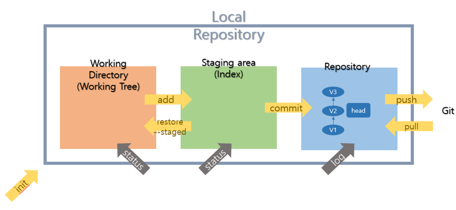

# Git

## Git이란?

* 분산 버전 관리 시스템(DVCS, Distributed Version Control System)
* 2005년 리눅스 커널(윈도우 전세계 오픈소스 버전)을 위한 도구로 리누스 토르발스가 개발
* 컴퓨터 파일의 변경사항을 추적하고 여러 명의 사용자들 간에 해당 파일들의 작업을 조율

### 버전 관리

* 생성되는 수 많은 버전의 파일들(최종, 진짜최종, 진짜진짜최종...)
* 오픈소스 사례: 크로미움. 백만개의 폴더, Git을 안썼다면 25GB. GIt에서는 1.58GB.
* 구글독스: 하나의 파일이지만 버전을 기록, 확인
* 버전관리(VCS), 소스코드 관리(SCM): 동일한 정보에 대한 여러 버전을 관리하는 것.
  * **하루**/과목/목차 단위로 진행.

### CVCS vs DVCS

* 중앙집중식버전관리시스템은 중앙에서 버전을 관리하고 파일을 받아서 사용. 클라이언트는 버전x
* 분산버전관리시스템은 원격 저장소(remote repository)를 통해 협업하고, 모든 히스토리(버전)를 클라이언트들이 공유. 
  * 원격저장소/서버: 멀리 있는 저장소
  * 로컬(local): 개별 컴퓨터
  * 클라이언트: 인터넷을 사용하고 있는 나

### Git Bash

* 윈도우에서 Git을 활용하기 위한 기본 도구
* 프롬프트 기본 인터페이스
  * 컴퓨터 정보
  * 디렉토리
  * $

#### Command Line Interface(CLI)

* CLI: 가상 터미널 또는 텍스트 터미널을 통해 사용자와 컴퓨터가 상호 작용하는 방식. 명령 기반의 인터페이스
  * 상태를 확인하면서 명령할 것. 어디에서 명령하는지(경로 확인), **ls**(디렉토리 리스트보는 명령어)
  * 인터페이스: 컴퓨터와 사용자 간의 접면
  * 내가 무엇인가를 알고 싶으면 명령을 하고 그 결과를 읽어야 한다.
  * . = 내가 지금 있는 곳     .. = 상위폴더
  * Ctrl + L을 통해 창 초기화 가능
* 작업 명령은 사용자가 툴바 키보드 등을 통해 문자열의 형태로 입력
* 인터페이스를 제공하는 프로그램을 명령 줄 해석기 또는 셸

* 윈도우에서 사용하는 것은 GUI. 그래픽 기반의 인터페이스

| 명령어                       | 내용                                                         |
| ---------------------------- | ------------------------------------------------------------ |
| pwd                          | 현재 디렉토리 출력. full 경로 알 수 있다. (Print Working directory) |
| cd < path >                  | 디렉토리 이동                                                |
| ls                           | 목록(LiSt)                                                   |
| mkdir < name >               | 디렉토리 생성(make directory)                                |
| rm < name > / rm -r < name > | 파일 / 폴더 삭제(remove)                                     |
| touch                        | 빈 파일 생성(파일의 날짜와 시간을 수정) (만지면 생성한다)    |

### Git 기초 흐름



* head: 움직이며 내가 보는 곳 표시
* Version들은 linked list로 연결되어 V2를 볼 때 V3만 볼 수 있다.

#### Git 저장소 생성

```bash
#기본 명령어. $ git 명령 시 git command를 볼 수 있다.
$ git init						#.git 폴더 생성
$ git add 파일명				  #파일명 대신 .을 쓰면 현재 위치의 모든 변경내용 올림
$ git commit -m '커밋 메세지'	 #커밋로그 작성
$ git push origin master		#git에 올리기
$ git status
$ git log						#상태 보기
```

* $ git init: 특정 폴더에 .git 저장소(repository)를 만들어 관리

  * .git 폴더가 생성되며 (master)라는 표기를 확인할 수 있음
    * 하위 폴더에 또 만들 필요 없음.
  * 해당 폴더를 지우게 되면 모든 버전이 삭제되니 주의한다.

* 작업을 하고 변경된 파일을 모아(add) 버전으로 기록한다.(commit)

* 단계의 흐름

  * Working Directory: 내가 작업하고 있는 실제 디렉토리 - untracked

    ​		$ git add < file >:  W.D 상의 파일 변경사항을 Staging area에 추가

    ​									 	Untracked, Modified 파일 변경사항을 Staged로 변경 

  * Staging Area(Index): 버전으로 기록하기 위한 파일 변경 사랑의 목록 -staged

    ​		$ git commit -m 'message': staged 상태의 파일들을 커밋을 통해 버전으로 기록

    ​														   + 메세지는 항상 버전의 내용(변경사항)에 대해 나타낼 수 있도록 기록

  * Repository(저장소. commit): 커밋(버전)들이 기록되는 곳-commited

* $ git status: Working Directory, Staging Area의 상태를 볼 수 있다.

  * Untracked filed: 커밋된 적 없는 파일(Working tree)
  * Changes not staged for commit: 커밋된 파일(Working tree)
  * Changes to be committed -> staging area
  * Nothing to commit, working tree clean

* $ git log: 변경사항(버전) 볼 수 있다. 현재 저장소에 기록된 커밋을 조회

* 파일을 조작하는 방법 4가지(CRUD)

  * 생성 Create
  * ~~읽기 Read~~
  * 수정 Update
  * 삭제 Delete

#### 원격 저장소(Remote Repository)

* 네트워크를 활용한 저장소. GitHub, GitLab, Bitbucket
* 명령어

| 명령어                              | 내용                                    |
| ----------------------------------- | --------------------------------------- |
| git clone < url >                   | 원격 저장소 복제(로컬 저장소 없을 때)   |
| git remote -v                       | 원격 저장소 정보 확인                   |
| git remote add <원격저장소> < url > | 원격저장소 추가(일반적으로 origin)      |
| git remote rm <원격저장소>          | 원격 저장소 삭제                        |
| git push <원격저장소><브랜치>       | 로컬 저장소의 커밋을 원격 저장소로 push |
| git pull <원격저장소><브랜치>       | 원격 저장소의 커밋을 로컬 저장소로 pull |

##### fetch와 pull의 차이

* fetch는 받아오기만 하고, pull은 fetch 및 병합까지 한다.

#### 기본 흐름

* 파일이 아닌 커밋을 push하거나 pull
* 원격저장소에서 직접 수정x => 수정했으면 pull 한번 해주고 다시 push를 시도해보자.
* 모든 파일변경 수정 삭제 생성... => 로컬에서 하자. 커밋 열심히
  * 데일리커밋, TIL, 프로젝트, 로컬
* .git에는 버전이 저장되어있는 것이다.

#### Q. 다음 status에서 알 수 있는 것은?

```bash
$ git status

#커밋할 변경사항들(staging area)
Changes to be committed:
	(use "git restore --staged <file>. . ." to unstage)
		deleted:	b.txt
		
#커밋을 위해 준비되지 않은 변경사항(Staging area X => working directory) 커밋된 적 있다.
Changes not staged for commit:
	(use "git add <file>. . ." to update what will be committed)
	(use "git restore <file>. . ." to discard changes in working directory)
		modified:	a.txt
		
#트래킹되지 않은 파일들(Working directory) 등록된 적 없다.
Untracked files:
	(use "git add <file>. . ." to include in what will be committed)
		c.txt
```

* Working directory: a, c 
* Staging Area: b

### Git branch

* <u>나뭇가지 형태</u>로 여러 갈래로 작업공간을 나누어 git이 관리하는 파일 트리에 한해서 원래 코드와 상관없이 **독립적으로 작업**할 수 있도록 돕는다.
* (master): branch 중 가장 중심이 되는 것. 원본에 대한 것을 진행한다. 상용(실제 서비스로 사용됨. 세상에 공개가 되어있다.)
* 장점
  * 독립공간 형성=> 원본에 대해 안전한 상태로 진행
    * 별도의 브랜치에서 에러를 수정/삭제한다. 마스터에 영향을 끼치지 않는다. 작업이 끝난 후에 다시 master로 반영
  * 하나의 작업은 하나의 브랜치에서 진행 => 관리 측면에서 체계적인 개발 가능
  * 다른 버전관리시스템보다 매우 빠르고 가볍다.

```bash
$ git init					#local 저장소로 형성. master branch 만들어짐
$ git branch				#branch 목록 확인 
$ git branch 브랜치이름		 #새로운 branch 생성
$ git branch -d 브랜치이름	 #특정 브랜치 삭제. master 브랜치에 병합된 브랜치만 삭제 가능
$ git branch -D 브랜치이름	 #병합에 상관없이 강제 삭제
$ git log --oneline			#간단하게 한 줄로 커밋들을 확인할 수 있다
$ git switch 브랜치이름		 #다른 브랜치로 이동. 버전관리가 되고 있는지 확인 필요
$ git log --oneline --all --graph	#가지가 어떻게 뻗어나가는지 확인
$ git switch -c 브랜치이름	 #branch를 새로 생성과 동시에 이동
```

**[참고]** checkout

> Switch branches or restore

- 명확하게 구분하기 위해 switch(: Switch branches)와 restore(: restore working tree files)로 분리하여 사용한다.

- 명령어 비교

  - 브랜치 이동

    ```bash
    $ git checkout 브랜치명
    
    $ git switch 브랜치명
    ```

  - 브랜치 생성 및 이동

    ```bash
    $ git checkout -b 브랜치명
    
    $ git switch -c 브랜치명
    ```

  - Unstaged 상태의 변경(modified) 파일을 복구

    ```bash
    $ git checkout -- README.md
    
    $ git restore README.md
    ```

#### merge(병합)

* branch에서 개발이 끝난 후 다른 branch나 master에 반영

  ```bash
  $ git merge 병합할_브랜치이름
  ```

* merge가 되면 그 branch의 역할은 끝난 것. => <u>branch 삭제</u>해준다

* 주의사항

  * merge하기 전 합쳐지는 쪽인 메인 브랜치로 switch해야한다

* 종류

  1. fast-forward: HEAD가 앞으로 나간다. merge된 새로운 버전이 만들어지지 않는다.

     - 조건: branch에서 작업하는 동안 과거에 있던 master는 변화 없음

     - master, branch를 fast-forward하면 HEAD -> master, branch

  2. 3-way merge(merge commit)

     - 조건: branch에서 작업하는 동안 과거에 있던 master 변화 있음.

     - 세 개의 commit(공통된 조상, master와 branch의 각각의 최신 commit)을 별도로 merge시키고 새로운 버전 만들어진다

  3. merge conflict

     - merge하는 두 브랜치에서 같은 파일의 같은 부분을 동시에 수정하고 merge하면, git은 해당 부분을 자동으로 merge해주지 못함.

       - git status를 해보면 both modified 상태인 것을 볼 수 있다
       - 반면, 동일 파일이더라도 서로 다른 부분을 수정했다면, conflict 없이 자동으로 merge commit된다.

     - modified 이후 commit할 때에는 commit 메세지를 쓰지 않는다.(git commit)

       - vim editor가 켜지고, 맨 위에 커밋 이름이 나온다.(알아서 지정해줌. 커밋에 대한 정보도 써준다.)

       - 저장하고 나가야한다.(명령모드로 가야함.) 

         - esc 누르고 :wq 쓴 후 엔터

         

## Undoing things

### 1. 파일 내용을 수정 전으로 되돌리기

> "Unmodifying a Modified File" 
>
> Working Directory에서 파일을 수정했을 때, 파일의 수정 사항을 취소하고, 원래 모습대로 돌리기 위한 방법

#### (1) git restore <파일 이름>

-  git의 추적이 되고 있는, 즉 **버전 관리가 되고 있는 파일만** 되돌리기 가능
- 원래 파일로 덮어썼기 때문에 <u>수정한 내용은 전부 사라짐</u>
- 한 번 git restore를 통해 수정을 취소하면, <u>해당 내용을 복원할 수 없음</u>

1. 이미 버전 관리가 되고 있는 test.md 파일을 변경 후 저장(save)

   ```markdown
   # test.md
   
   Hello
   World	<- "World"라는 새로운 내용 추가 후 저장
   ```

2. test.md는 `modified` 상태

   ```bash
   $ git status
   On branch master
   Changes not staged for commit:
     (use "git add <file>..." to update what will be committed)
     (use "git restore <file>..." to discard changes in working directory)
           modified:   test.md
   
   no changes added to commit (use "git add" and/or "git commit -a")
   ```

3. git restore를 통해 수정 전으로 되돌리기

   ```bash
   $ git restore test.md
   ```

   ```markdown
   # test.md
   
   Hello
   -------------------------------------
   World가 삭제 되면서, 수정 전으로 되돌아감
   ```

**[참고]**

```bash
 # Git(2.23.0 이전)에서는...
 
 $ git checkout -- <파일 이름>
```

### 2. 파일 상태를 Unstage로 되돌리기

> "Unstaging a Staged File" 
>
> Staging Area와 Working Directory 사이를 넘나드는 방법

- git add를 통해서 파일을 Staging Area에 올렸을 때, 파일을 다시 Unstage 상태로 내리기 위한 방법

#### (1) git rm --cached <파일 이름>

> “to unstage and remove paths only from the staging area”
>
> 기존 commit이 없을 때

1. 새 폴더에서 git 초기화 후 진행 test.md 파일을 생성하고 `git add`를 진행

   ```bash
   $ touch test.md		#파일 생성
   $ git add test.md	
$ git status
   On branch master
   
   No commits yet

   Changes to be committed:
     (use "git rm --cached <file>..." to unstage)
           new file:   test.md
   ```
   
2. Staging Area에 올라간 test.md를 다시 내리기(unstage)

   ```bash
   $ git rm --cached test.md
   rm 'test.md'		
   ```

   ```bash
   $ git status
   On branch master	
   
   No commits yet
   
   Untracked files:
     (use "git add <file>..." to include in what will be committed)
           test.md
   
   nothing added to commit but untracked files present (use "git add" to track)
   ```


#### (2) git restore --staged <파일 이름>

> “the contents are restored from HEAD”
>
> 기존 commit이 존재할 때($ git commit -m "커밋 메세지"를 했을 때)

1. test.md의 내용을 변경하고 `git add`를 진행

   ```bash
   # test.md 파일 변경 후
   $ git add test.md
   ```

   ```bash
   $ git status
   On branch master
   Changes to be committed:
     (use "git restore --staged <file>..." to unstage)
           modified:   test.md
   ```

2. Staging Area에 올라간 test.md를 다시 내리기(unstage)

   ```bash
   $ git restore --staged test.md
   ```

   ```bash
   $ git status
   On branch master
   Changes not staged for commit:
     (use "git add <file>..." to update what will be committed)
     (use "git restore <file>..." to discard changes in working directory)
           modified:   test.md
   
   no changes added to commit (use "git add" and/or "git commit -a")
   ```

**[참고]**

 ```bash
# Git(2.23.0 이전)에서는...
 
$ git reset HEAD <파일 이름>
 ```

### 3. 바로 직전 완료한 커밋 수정하기

> 직전 커밋을 취소하고, 모든 파일을 포함해서 다시 커밋하기 위한 방법

#### (1) git commit --amend

- --amend 옵션으로 커밋을 고치는 작업은, 추가로 작업한 일이 작다고 하더라도 이전의 커밋을 완전히 새로 고쳐서 새 커밋으로 변경하는 것을 의미함
- <u>이전의 커밋은 일어나지 않은 일</u>이 되는 것이고, 당연히 <u>히스토리에도 남지 않음</u>

- 장점:  마지막 커밋 작업에서 뭔가 빠뜨린 것을 넣거나 변경하는 것을 새 커밋으로 분리하지 않고 하나의 커밋에서 처리

##### 1-1. 커밋 메시지만 수정하는 경우

> 마지막으로 커밋하고 나서 수정한 것이 없을 때(커밋하자마자 바로 이 명령을 실행하는 경우)

1. A 기능을 완성한 후 커밋

   ```bash
   $ git commit -m 'B feature completed'
   ```

2. 현재 커밋 해시 값 확인해두기

   ```bash
   $ git log
   ```

3. 커밋 메시지 수정을 위해 다음과 같이 입력

   ```bash
   $ git commit --amend
   
   hint: Waiting for your editor to close the file..[master c01f908] Add no.txt
   ...
   ```

4. Vim 편집기가 열린다. i를 누른 후 직전 커밋 메시지를 수정할 수 있다. 수정 후 esc를 누르면 command 모드로 바뀐다. 그 후 :wq로 나가기 

   ```bash
   B feature completed
   
   # Please enter the commit message for your changes. Lines starting
   # with '#' will be ignored, and an empty message aborts the commit.
   #
   # Date:      Wed Jan 12 01:25:10 2022 +0900
   #
   # On branch master
   #
   # Initial commit
   #
   # Changes to be committed:
   #       new file:   test.txt
   ```

5. 커밋 메세지를 수정하고 저장하면, <u>새로운 메세지로 변경</u>되며 커밋 **해시 값 또한 변경됨**

   ```bash
   $ git log
   ```

##### 1-2. 커밋 재작성

> Staging Area에 새로 올라온 내용이 있을 때

1. 실수로 bar.txt를 빼고 커밋 해버린 상황까지 만들어 봅시다.

   ```bash
   $ touch foo.txt bar.txt
   $ git add foo.txt
   ```

   ```bash
   $ git status
   On branch master
   Changes to be committed:
     (use "git restore --staged <file>..." to unstage)
           new file:   foo.txt
   
   Untracked files:
     (use "git add <file>..." to include in what will be committed)
           bar.txt
   ```

   ```bash
   $ git commit -m "foo & bar"
   
   [master 4221af6] foo & bar
    1 file changed, 0 insertions(+), 0 deletions(-)
    create mode 100644 foo.txt
   ```

   ```bash
   $ git status
   
   On branch master
   Untracked files:
     (use "git add <file>..." to include in what will be committed)
           bar.txt
   ```

2. 누락된 파일을 staging area로 이동

   ```bash
   $ git add bar.txt
   
   $ git status
   On branch master
   Changes to be committed:
     (use "git restore --staged <file>..." to unstage)
           new file:   bar.txt
   ```

3. `git commit --amend` 를 입력

   ```bash
   $ git commit --amend
   ```

4. Vim 편집기가 열림. (마찬가지로 커밋 메시지도 수정가능)

   ```bash
   foo & bar
   
   # Please enter the commit message for your changes. Lines starting
   # with '#' will be ignored, and an empty message aborts the commit.
   #
   # Date:      Mon Jun 7 22:32:58 2021 +0900
   #
   # On branch master
   # Changes to be committed:
   #       new file:   bar.txt
   #       new file:   foo.txt
   ```

5. Vim 편집기를 저장 후 종료하면 직전 커밋이 덮어 씌워짐. (커밋이 새로 추가된 것이 아님) 마찬가지로 커밋 **해시 값 또한 변경됨** 
   
```bash
   $ git commit --amend
   
   [master 7f6c24c] foo & bar
    Date: Mon Jun 7 22:32:58 2021 +0900
    2 files changed, 0 insertions(+), 0 deletions(-)
    create mode 100644 bar.txt
    create mode 100644 foo.txt
```

6. `git log -p` 를 사용하여 직전 커밋의 변경 내용을 볼 수 있다.


## Reset & Revert

- 공통점: 과거로 되돌린다
- 차이점: '과거로 되돌리겠다는 내용도 기록되는가 (== commit 이력에 남는가)’

### 1. git reset

> 예전 버전으로 돌아가고 싶을 때

**명령어**

```bash
$ git reset [옵션] <커밋 ID>
```

- **시계를 마치 과거로 돌리는 듯한 행위**로써, 특정 커밋 상태로 되돌아감

- 특정 커밋으로 되돌아 갔을 때, 해당 커밋 <u>이후로 쌓아 놨던 커밋들은 전부 사라짐</u>

  -> 다른 사람과 협업할 때 커밋 내역의 차이로 인해 충돌이 발생할 수 있다.

**옵션**

- `옵션`은 아래와 같이 세 종류가 있으며, 생략 시 `--mixed`가 기본 값

  1. `--soft`

     - **돌아가려는 커밋으로 되돌아가고**, 이후의 commit된 파일들을 `staging area`로 돌려놓음 (commit 하기 전 상태)

       => 즉, 다시 커밋할 수 있는 상태가 됨

  2. `--mixed`

     - **돌아가려는 커밋으로 되돌아가고**, 이후의 commit된 파일들을 `working directory`로 돌려놓음 (add 하기 전 상태)

       => 즉, unstage 된 상태로 남아있음

  3. `--hard`

     - **돌아가려는 커밋으로 되돌아가고**, 이후의 commit된 파일들(`tracked 파일들`)은 모두 working directory에서 삭제

       (**단**,  Untracked 파일은 그대로 Untracked로 남음)

  - 특정 커밋으로 reset했을 때 특정 커밋 이후 커밋되었던 파일들의 상태

  | 옵션    | Working Directory | Staging Area | Repository                |
  | ------- | ----------------- | ------------ | ------------------------- |
  | --soft  |                   | V            | HEAD가 특정 커밋을 가리킴 |
  | --mixed | V                 |              | HEAD가 특정 커밋을 가리킴 |
  | --hard  |                   |              | HEAD가 특정 커밋을 가리킴 |


#### 옵션별 결과

> 돌아가려는 커밋(first) 이후에 커밋된 `2.txt`, `3.txt`가 어떻게 처리되는지 확인

- 시작 전 커밋 확인

  ```bash
  $ git log --oneline
  20d320d (HEAD -> master) third
  1eb059e second
  6baf32f first
  ```

1. `--soft`

   ```bash
   $ git reset --soft 6baf
   $ git status
   On branch master
   Changes to be committed:
     (use "git restore --staged <file>..." to unstage)
           new file:   2.txt
           new file:	3.txt
   
   Untracked files:
     (use "git add <file>..." to include in what will be committed)
           untracked.txt
   ```

2. `--mixed`

   ```bash
   $ git reset 6baf
   $ git status
   On branch master
   Untracked files:
     (use "git add <file>..." to include in what will be committed)
           2.txt
           3.txt
           untracked.txt
           
   nothing added to commit but untracked files present (use "git add" to track)
   ```

3. `--hard`

   ```bash
   $ git reset --hard 6baf
   HEAD is now at 6baf32f first
$ git status
   On branch master
   Untracked files:
     (use "git add <file>..." to include in what will be committed)
           untracked.txt
           
   nothing added to commit but untracked files present (use "git add" to track)
   ```
   

 **[참고]**

 혹시나 이미 삭제한 커밋으로 다시 돌아가고 싶다면? → `git reflog`를 사용

 ```bash
 $ git reflog
 1a410ef HEAD@{0}: reset: moving to 1a410ef
 ab1afef HEAD@{1}: commit: modified repo.rb a bit
 484a592 HEAD@{2}: commit: added repo.rb
 
 $ git reset --hard <복구하고자 하는 커밋ID>
 
 # git reflog 명령어는 HEAD가 이전에 가리켰던 모든 커밋을 보여줌
 # 따라서 --hard 옵션을 통해 지워진 커밋도, reflog로 조회하여 돌아갈 수 있다
 ```

### 2. git revert

**명령어**

```bash
$ git revert <커밋 ID>
```

- **특정 사건을 없었던 일로 만드는 행위**로써, `이전 커밋을 취소한다는 새로운 커밋`을 만든다.(이전 커밋은 그대로 살아있다.)
- `git reset`은 커밋 내역을 삭제하는 반면, `git revert`는 **새로 커밋을 쌓는다**는 차이가 있다.

**사용 예시**

- 시작 전 커밋 확인

  ```bash
  $ git log --oneline
  20d320d third
  1eb059e second
  6baf32f first
  ```

- second 커밋으로 revert

  ```bash
  $ git revert 1eb059
  ```

- vim 편집기가 나오면 저장 후 종료

  ```bash
  $ git log --oneline
  f0b5364 (HEAD -> master) Revert "second" # 새로 쌓인 커밋
  20d320d third
  1eb059e second # 히스토리는 남아있음
  6baf32f first
  ```

- second 커밋에서 있었던 `2.txt`가 사라진 것을 확인(second 커밋을 없었던 일로 만든 것)

**[중요]** `git reset` vs `gir revert`

- `git reset --hard 5sd2f42`라고 작성하면 5sd2f42라는 커밋`으로` 돌아간다는 뜻

- `git revert 5sd2f42`라고 작성하면 5sd2f42라는 커밋`을` 되돌린다는 뜻

**[참고]**

 ```bash
# 공백을 통해 여러 커밋을 한꺼번에 되돌리기 가능
 $ git revert 7f6c24c 006dc87 3551584
 
 # 범위 지정을 통해 여러 커밋을 한꺼번에 되돌리기 가능
 $ git revert 3551584..7f6c24c
 
 # 커밋 메시지 작성을 위한 편집기를 열지 않음 (자동으로 커밋 완료)
 $ git revert --no-edit 7f6c24c
 
 # 자동으로 커밋하지 않고, Staging Area에만 올림 (이후, git commit으로 수동 커밋)
 # 이 옵션은 여러 커밋을 revert 할 때 하나의 커밋으로 묶는게 가능
 $ git revert --no-commit 7f6c24c
 ```


## Git workflow

> Branch와 Pull request를 이용한 협업

### Feature Branch Workflow

> Shared repository model(저장소의 소유권이 있는 경우)

1. 프로젝트를 만들고, 각 팀원에게 콜라보를 등록.  등록 후 clone을 통해 저장소를 로컬에 복제한다.

2. 기능 추가를 위해 branch 생성 및 기능 구현
   
- master는 최종적으로 병합할 때 사용
   
3. 기능 구현 후 원격 저장소에 브랜치 반영

   ```bash
   $ git push origin <브랜치 이름>
   ex) 
   $ git push origin feature/signup
   ```

4. master 브랜치에 Pull Request 요청. 확인하는 작업을 마친 후 병합 완료됨. (병합 완료된 브랜치는 삭제됨)

5. 각 local은 master 브랜치로 switch한 후 병합된 master의 내용을 pull한다.

6. 원격 저장소에서 병합 완료된 로컬 브랜치 삭제

### Forking Workflow

> Fork & Pull model(저장소의 소유권이 없는 경우)
>
> ex. 오픈소스

1. 소유권이 없는 원격 저장소를 fork를 통해 복제한다.

2. 복제한 것을 clone 받는다.

3. 추후 로컬 저장소를 원격 저장소와 동기화하기 위해 URL을 연결

   ```bash
   $ git remote add upstream <원본 URL>
   ```

4. 기능 추가를 위해 branch 생성 및 기능 구현

5. 기능 구현 후 원격 저장소(복제한 곳. origin)에 브랜치 반영

6. 원본(upstream)에 pull request를 요청

7. upstream의 병합된 master의 내용을 pull한다. 원격 저장소에서 병합 완료 된 로컬 브랜치 삭제 

