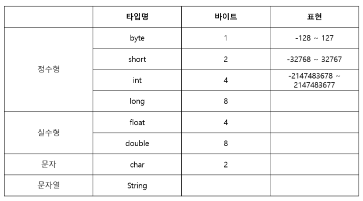

# JAVA

## 객체&인스턴스

### 객체지향 프로그램

- 객체는 사람이다
  - 사람이 가지고 있는 속성(멤버 변수)과 행동(메서드)을 정의해 놓은 것

### 객체 정의

```java
public class Person{				//Person 객체(틀)
    String name = "홍길동";		  //멤버변수 선언(name, age)
    int age = 40;
    
    public void setName(String n)	//메서드
    {
        name = n;
    }
    public void setAge(int i){		//메서드
        age = l;
    }
}
```

### 객체 생성

```java
public class Person{		
    String name = "홍길동";		//객체 정의 영역
    int age = 40;    
    public void setName(String n)	
    {
        name = n;
    }
    public void setAge(int i){		
        age = l;
    }
}

public static void main(String args){	//main부터 시작
    Person p1 = new Person();	//p1이라는 이름으로 새로운 Person 만든다. p1 = 인스턴스
    p1.set_name("홍길동");
    p1.set_age(40);
}
```

### 객체 변수 & 메서드

- 멤버변수

  - 객체에 정의된 속성

  - 정의할 때

    - 형식: 접근 지정자 데이터타입 변수명;
      - 접근 지정자: 변수에 누가 접근할 수 있는지. 
        - public: 아무나 다 쓸 수 있다.
        - private: 내 클래스/객체 내에서만 쓸 수 있다.
        - protected: 상속관계/같은 패키지 내에서만 쓸 수 있다.
        - default: 아무것도 안썼을 때. 같은 패키지 내에서만 쓸 수 있다.
    - 예시
      - public String name;
      - private int age;
      - protected int height;

  - 사용할 때

    - 형식: 인스턴스명.멤버변수명 = 값;
    - 예시
      - p1.name="홍길동";
      - p1.age=40;

    **[주의]** 접근 지정자에 따라(private의 경우) 직접 사용이 불가능하다.

- 메서드

  - 객체에 정의된 **행동**

  - 정의할 때

    - 형식: 접근지정자 리턴타입 메서드명(인자){
                    하려고 하는 일을 정의
                }

    - 예시

      ```java
      //1
      public String get_name(){
          return this.name;
      }
      
      //2
      public void set_age(int age){
          this.age = age
      }
      ```

  - 사용할 때

    - 형식: 객체명.메서드명(인자값);
    - 예시
      - p1.set_name("홍길동");
      - p1.get_age();

    **[주의]** 접근 지정자에 따라(private의 경우) 직접 사용이 불가능하다.

### 데이터타입




