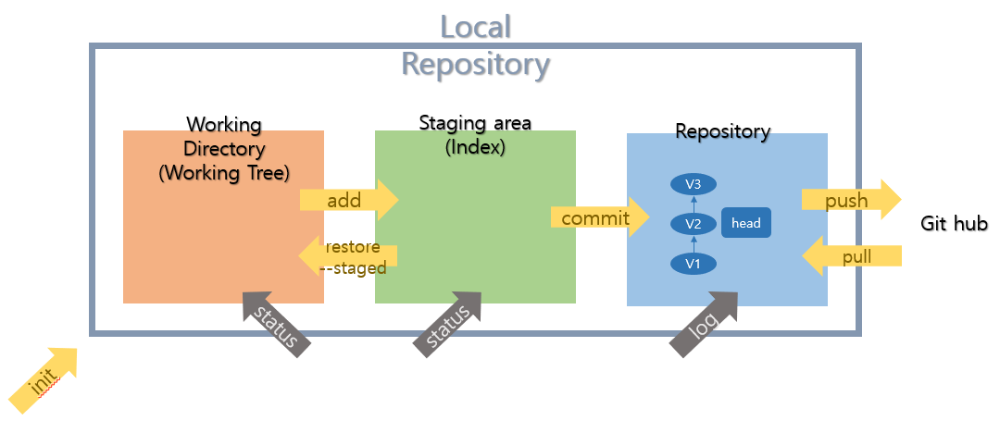

# Markdown & GIT & JSON

## Markdown

* 제목: #으로 작성. h1~h6까지 표현 가능. # 개수에 따라 크기가 다르다.
* 순서가 없는 목록(unordered list): *, -
* 순서가 있는 목록(ordered list): 1., 2., ...
* 하이라이팅: `
* 들여쓰기: tab. (들여쓰기 취소는 shift + tab)
* 코드 블록: ```python
* 링크: [~~] (주소)로 쓰면 된다.
* 인용문: >
* 표는 직접 삽입하는 것이 더 편하다.
* 이미지는 드래그앤드롭. 이미지 복사 시 .assets 경로로 복사하는 설정해두면 좋다.
* *기울임*  **굵게**  ~~취소선~~ ---수평선


## Git

* 분산 버전 관리 시스템(DVCS, Distributed Version Control System)
* 2005년 리눅스 커널(윈도우 전세계 오픈소스 버전)을 위한 도구로 리누스 토르발스가 개발
* 컴퓨터 파일의 변경사항을 추적하고 여러 명의 사용자들 간에 해당 파일들의 작업을 조율


### 버전 관리

* 생성되는 수 많은 버전의 파일들(최종, 진짜최종, 진짜진짜최종...)
* 오픈소스 사례: 크로미움. 백만개의 폴더, Git을 안썼다면 25GB. GIt에서는 1.58GB.
* 구글독스: 하나의 파일이지만 버전을 기록, 확인
* 버전관리(VCS), 소스코드 관리(SCM): 동일한 정보에 대한 여러 버전을 관리하는 것.
  * **하루**/과목/목차 단위로 진행.


### CVCS vs DVCS

* 중앙집중식버전관리시스템은 중앙에서 버전을 관리하고 파일을 받아서 사용. 클라이언트는 버전x
* 분산버전관리시스템은 원격 저장소(remote repository)를 통해 협업하고, 모든 히스토리(버전)를 클라이언트들이 공유. 
  * 원격저장소/서버: 멀리 있는 저장소
  * 로컬(local): 개별 컴퓨터
  * 클라이언트: 인터넷을 사용하고 있는 나


### Git Bash

* 윈도우에서 Git을 활용하기 위한 기본 도구
* 프롬프트 기본 인터페이스
  * 컴퓨터 정보
  * 디렉토리
  * $


#### Command Line Interface(CLI)

* CLI: 가상 터미널 또는 텍스트 터미널을 통해 사용자와 컴퓨터가 상호 작용하는 방식. 명령 기반의 인터페이스
  * 상태를 확인하면서 명령할 것. 어디에서 명령하는지(경로 확인), **ls**(디렉토리 리스트보는 명령어)
  * 인터페이스: 컴퓨터와 사용자 간의 접면
  * 내가 무엇인가를 알고 싶으면 명령을 하고 그 결과를 읽어야 한다.
  * . = 내가 지금 있는 곳     .. = 상위폴더
  * Ctrl + L을 통해 창 초기화 가능
* 작업 명령은 사용자가 툴바 키보드 등을 통해 문자열의 형태로 입력
* 인터페이스를 제공하는 프로그램을 명령 줄 해석기 또는 셸

* 윈도우에서 사용하는 것은 GUI. 그래픽 기반의 인터페이스

| 명령어                   | 내용                                                         |
| ------------------------ | ------------------------------------------------------------ |
| pwd                      | 현재 디렉토리 출력. full 경로 알 수 있다. (Print Working directory) |
| cd <path>                | 디렉토리 이동                                                |
| ls                       | 목록(LiSt)                                                   |
| mkdir <name>             | 디렉토리 생성(make directory)                                |
| rm <name> / rm -r <name> | 파일 / 폴더 삭제(remove)                                     |
| touch                    | 빈 파일 생성(파일의 날짜와 시간을 수정) (만지면 생성한다)    |


### Git 기초 흐름



* head: 움직이며 내가 보는 곳 표시
* Version들은 linked list로 연결되어 V2를 볼 때 V3만 볼 수 있다.

#### Git 저장소 생성

```bash
#기본 명령어. $ git 명령 시 git command를 볼 수 있다.
$ git init						#.git 폴더 생성
$ git add 파일명				  #파일명 대신 .을 쓰면 현재 위치의 모든 변경내용 올림
$ git commit -m '커밋 메세지'	 #커밋로그 작성
$ git push origin master		#git에 올리기
$ git status
$ git log						#상태 보기
```

* $ git init: 특정 폴더에 .git 저장소(repository)를 만들어 관리

  * .git 폴더가 생성되며 (master)라는 표기를 확인할 수 있음
    * 하위 폴더에 또 만들 필요 없음.
  * 해당 폴더를 지우게 되면 모든 버전이 삭제되니 주의한다.

* 작업을 하고 변경된 파일을 모아(add) 버전으로 기록한다.(commit)

* 단계의 흐름
  * Working Directory: 내가 작업하고 있는 실제 디렉토리 - untracked

    ​		$ git add <file>:  W.D 상의 파일 변경사항을 Staging area에 추가

    ​									 	Untracked, Modified 파일 변경사항을 Staged로 변경 

  * Staging Area(Index): 버전으로 기록하기 위한 파일 변경 사랑의 목록 -staged

    ​		$git commit -m <message>: staged 상태의 파일들을 커밋을 통해 버전으로 기록

    ​														   + 메세지는 항상 버전의 내용(변경사항)에 대해 나타낼 수 있도록 기록

  * Repository(저장소. commit): 커밋(버전)들이 기록되는 곳-commited
  
* $ git status: Working Directory, Staging Area의 상태를 볼 수 있다.

  * Untracked filed: 커밋된 적 없는 파일(Working tree)
  * Changes not staged for commit: 커밋된 파일(Working tree)
  * Changes to be committed -> staging area
  * Nothing to commit, working tree clean

* $ git log: 변경사항(버전) 볼 수 있다. 현재 저장소에 기록된 커밋을 조회

* 파일을 조작하는 방법 4가지(CRUD)

  * 생성 Create
  * ~~읽기 Read~~
  * 수정 Update
  * 삭제 Delete


#### 원격 저장소(Remote Repository)

* 네트워크를 활용한 저장소. GitHub, GitLab, Bitbucket
* 명령어

| 명령어                           | 내용                                    |
| -------------------------------- | --------------------------------------- |
| git clone <url>                  | 원격 저장소 복제(로컬 저장소 없을 때)   |
| git remote -v                    | 원격 저장소 정보 확인                   |
| git remote add <원격저장소><url> | 원격저장소 추가(일반적으로 origin)      |
| git remote rm <원격저장소>       | 원격 저장소 삭제                        |
| git push <원격저장소><브랜치>    | 로컬 저장소의 커밋을 원격 저장소로 push |
| git pull <원격저장소><브랜치>    | 원격 저장소의 커밋을 로컬 저장소로 pull |

##### fetch와 pull의 차이

* fetch는 받아오기만 하고, pull은 fetch 및 병합까지 한다.


#### 기본 흐름

* 파일이 아닌 커밋을 push하거나 pull
* 원격저장소에서 직접 수정x => 수정했으면 pull 한번 해주고 다시 push를 시도해보자.
* 모든 파일변경 수정 삭제 생성... => 로컬에서 하자. 커밋 열심히
  * 데일리커밋, TIL, 프로젝트, 로컬
* .git에는 버전이 저장되어있는 것이다.


#### Quiz

##### 다음 status에서 알 수 있는 것은?

```bash
$ git status

#커밋할 변경사항들(staging area)
Changes to be committed:
	(use "git restore --staged <file>. . ." to unstage)
		deleted:	b.txt
		
#커밋을 위해 준비되지 않은 변경사항(Staging area X => working directory) 커밋된 적 있다.
Changes not staged for commit:
	(use "git add <file>. . ." to update what will be committed)
	(use "git restore <file>. . ." to discard changes in working directory)
		modified:	a.txt
		
#트래킹되지 않은 파일들(Working directory) 등록된 적 없다.
Untracked files:
	(use "git add <file>. . ." to include in what will be committed)
		c.txt
```

* Working directory: a, c 
* Staging Area: b


## JSON(JavaScript Object Notation)

* 자바스크립트 객체 표기법. 웹 어플리케이션에서 데이터를 전송할 때 사용

* 문자 기반(텍스트) 데이터 포맷. 쉽게 활용 가능
* 활용
  * 객체(리스트, 딕셔너리 등)를 JSON으로 변환 - json.dumps
  * JSON을 객체(리스트, 딕셔너리 등)로 변환 - json.load
  * Pprint : 임의의 파이썬 데이터 구조 예쁘게 인쇄
  * 리스트 순회
    * 이름만 출력하고 싶으면? for문 사용하여 키로 접근한다.
    * 가격만 출력하고 싶으면? 없는 값 찾으면 key error 나옴. dict.get(key, defailt-value없을 때 나올 값-) 사용


 ### 데이터 활용을 위한 파일 입력 활용법

```python
f = open('workfile', 'w')			#파일 객체 활용

with open('workfile') as f:			#with 키워드 활용(일반적)
    read_data = f.read
f.closed

open(file, mode='r', encoding=None)	#기본값 설정.파일명, 텍스트모드, 인코딩방식 순.
									#인코딩 방식은 일반적으로 utf-8 사용한다.
```


+) 알고리즘/문제풀이에서는 리스트, 조건문, 반복문을 많이 쓴다.

​	 실무에서는 딕셔너리와 리스트를 많이 사용한다.
