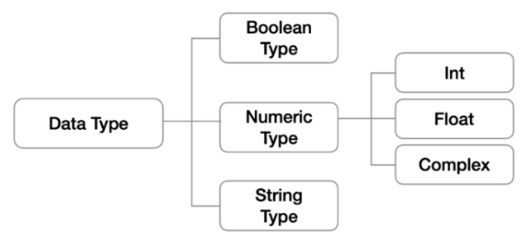
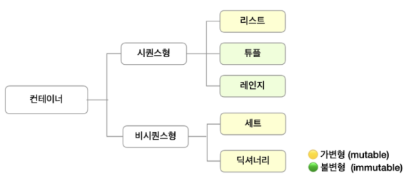

# 데이터&제어문

## Python 기초

### 컴퓨터 프로그래밍 언어

* 컴퓨터: calculation + remember

* 프로그래밍: 명령어를 만드는 것

* 언어: 자신의 생각을 나타내고 전달
  
  -> 컴퓨터에게 명령하기 위한 약속
1. 선언적 지식
   
   사실에 대한 내용

2. 명령적 지식
   
   How-to
   
   -> 컴퓨터에서는 이를 사용한다.
* 파이썬의 특징: Easy to learn, Expressive language, 크로스 플랫폼 언어, 인터프리터 언어, 객체지향 프로그래밍
  * 객체지향 프로그래밍: 속성을 보거나 재사용 가능하게 여러가지를 할 수 있도록 Person이라는 틀(class)을 짜고 속성과 행동(함수) 정의

### 파이썬 개발 환경

* 대화형 환경: 파이썬 기본 Interpreter. ex. IDLE, Jupiter Lab(IDLE의 확장)
* 스크립트 실행: .py 파일을 작성하고 IDE(통합개발환경) 혹은 Text Editor(메모장+a) 활용. ex. Pycharm

### 기초 문법

* 코드 스타일 가이드: 코드를 어떻게 작성할지에 대한 가이드라인. PEP8 참고. 일관적으로 코드 작성하기
  * 들여쓰기 = 1탭 = space 4칸. space, tab 혼용 불가

#### 변수

> 메모리에 저장된 객체를 참조하기 위해 사용되는 이름, 이름에 값을 할당한다. 



* 객체: 숫자, 문자, 클래스 등 값을 가지고 있는 모든 것
* type(): 변수에 할당된 값의 타입
* id(): 변수에 할당된 값의 고유한 아이덴티티 값. 메모리주소
* 파이썬은 동적 타이핑 언어 = 수 저장했다가 문자열 저장해도 됨

##### 변수 연산

숫자 + 숫자 = 덧셈

문자 + 문자 = 연결

문자 * 3 = 문자3번반복

##### 변수 할당

* 같은 값을 동시에 할당할 수 있다.
* 다른 값을 동시에 각각 할당할 수 있다.

```python
x, y = 10,20
x, y = y, x        #값을 바꿔서 저장하는 코드
```

#### 식별자

>  파이썬 객체를 식별하는데 사용하는 이름.

* 영문알파벳, _, 숫자로 구성. ex. red_apple
* 첫 글장에 숫자 올 수 없음.
* 길이제한 없고, 대소문자 구별.
* 예약어는 사용할 수 없다. ex. as, await, yield, nonlocal 등
  * 내장함수나 모듈의 이름으로도 만들면 안됨. 기존 이름에 다른 값을 할당하게 되므로 더 이상 동작하지 않음

#### 주석

>  코드에 대한 설명. 컴퓨터는 실행하지 않는다.

* '#', '''으로 사용. 여러 줄의 주석처리는 ctrl+/를 사용한다.

* 특이한 형태의 주석 - docstring

#### 자료형

##### Boolean

> True/False 값을 가짐. 비교/논리 연산을 수행함에 있어서 활용됨

* 0, 0.0, ( ), [ ], { }, ' ', None -> False
  * bool([0]) == True

##### Numeric

###### int

* 모든 정수의 타입은 int.

* 매우 큰 수를 나타낼 때 오버플로우가 발생하지 않음. Arbitary precision arithmetic(가용 메모리들을 활용하여 모든 수 표현에 활용).
  
  * 오버플로우: 데이터 타입별로 사용할 수 있는 메모리의 크기를 넘어서는 상황

* 진수 표현
  
  * 2진수: 0b
  * 8진수: 0o
  * 16진수: 0x

###### float

* 지수 표기법을 활용한다. (e. e^2 = 100)
* Floating point rounding error: 부동소수점에서 실수 연산 과정에서 발생 가능

```python
3.14 - 3.02 == 0.12    #False

3.14 - 3.02    #결과 0.1200000000000001
```

* 따라서 값을 비교하는 과정에서 정수가 아닌 실수인 경우 주의. 매우 작은 수보다 작은지를 확인하거나 math 모듈 활용. 
  * abs, sys.float_info.epsilon, math.isclose 활용

###### 복소수(Complex)

> 실수부와 허수부로 구성된 복소수. 허수부를 j로 표현

##### String Type

> 모든 문자는 string 타입

* ', "를 활용하여 표기. 혼용하지 말자
  
  * 중첩따옴표: 특정 따옴표 안에 따옴표를 출력하기 위해 혼용
  * 삼중따옴표: 따옴표 안에 따옴표를 넣을 때, 여러줄을 나눠 입력할 때 편리

* Immutable: 불변한다. 인덱싱 불가.

* Iterable: 반복이 가능하다.

###### Escape sequence

> 문자열 내에서 특정 문자나 조작을 위해 역슬래시를 활용하여 구분

| 예약문자 | 내용(의미)      |
|:----:|:-----------:|
| \n   | 줄 바꿈        |
| \t   | 탭           |
| \r   | 캐리지리턴       |
| \0   | 널(Null)     |
| \\\  | \           |
| \\'  | 단일인용부호(' ') |
| \\"  | 이중인용부호(" ") |

###### String Interpolation

> 문자열을 변수를 활용하여 만드는 법. 

* % - formatting
* str.format()
* f-strings

```python
print('Hello:' + name + '성적은' + score)
print('Hello, %s: 성적은 %d' % (name, score))
print('Hello, {}: 성적은 {}'.format(name, score))
print(f'Hello, {name}: 성적은{score}')
```

##### None

> 값이 없음을 표현하기 위한 타입. 
> 
> 일반적으로 반환 값이 없는 함수에서 사용하기도 한다.

#### 컨테이너

> 여러 개의 값을 담을 수 있는 객체. 서로 다른 자료형을 저장할 수 있음

* 순서가 있는 데이터 vs 순서가 없는 데이터
  * 순서가 있다 != 정렬되어 있다.



##### 시퀀스형 컨테이너

###### 리스트

> 순서를 가지는 0개 이상의 객체를 참조하는 자료형. mutable 요소들의 시퀀스
> 
> 대괄호 형태로 출력

* 비어있는 리스트를 먼저 만들거나, 내용이 있는 리스트를 만든다.
  
  * [] 혹은 list()

* 순서가 있는 시퀀스. 인덱스를 통해 접근 가능
  
  * 리스트[0] = 맨 처음 요소
  * 리스트[-1] = 맨 뒤 요소

```python
boxes = ['A', 'B',['apple', 'banana', 'cherry']]
boxex[2][-1]        #cherry
boxes[2][-1][1]        #b
```

###### 튜플

> 순서를 가지는 0개 이상의 객체를 참조하는 자료형. 불변자료형. 불변한 요소들의 시퀀스
> 
> 항상 소괄호 형태로 출력

* 소괄호, tuple( )을 통해 생성
  
  * 단일 항목으로 구성된 튜플은 생성 시 값 뒤에 쉼표를 붙여야 한다.
  * 복수 항목의 경우 마지막 항목에 붙은 쉼표는 불필요

* 값에 대한 접근: my_tuple[i]

* 튜플 대입: 우변의 값을 좌변의 변수에 한번에 할당하는 과정

```python
x, y = 1, 2    #얘도 튜플 형태. 하나하나 들어간다.
```

###### 레인지

> 숫자의 시퀀스를 나타내기 위해 사용

* 기본형: range(n). 0부터 n-1까지
* 범위 지정: range(n, m). n 이상 m 미만
* 범위 및 스텝 지정: range(n, m, s). n부터 m-1까지 s만큼 증가

```python
list(range(1, 3, -1))    #결과: [ ]
```

##### 패킹과 언패킹

###### 패킹

> 우변의 객체 수가 좌변의 변수 수보다 많을 경우 객체를 순서대로 대입

```python
x, *y = 1, 2, 3, 4        #x=1, y=[2, 3, 4]
```

###### 언패킹

> 풀어서 표현할 때

* *패킹의 경우 리스트로 대입
* **패킹의 경우 튜플 형태로 대입

##### 비시퀀스형 컨테이너

###### Set

> 순서없이 0개 이상의 해시 가능한 객체를 참조하는 자료형. 가변자료형
> 
> 중복과 순서가 없는 구조
> 
> 집합과 동일한 구조. 중복없이 순서가 없는 자료구조

* 중괄호 혹은 set()을 통해 생성
  * {}(빈 중괄호)는 Dictionary
  * 빈 set을 만들기 위해서는 set()을 만들어야 한다.
* 집합과 동일한 구조
  * 순서가 없어 인덱스 접근이 불가능하다. 특정 값에 접근할 수 없음.
  * 중복된 값을 쉽게 제거. 순서대로 정렬은 못함

###### Dictionary

> 순서 없이 key-value(값) 쌍으로 이뤄진 객체를 참조하는 자료형

* 키는 불변 자료형만 가능. 리스트 불가. 중복되면 업데이트 된다.
* 값은 어떤 형태든 상관이 없다.
* 중괄호{} 혹은 dict()로 생성

##### 형 변환

* 암시적 형 변환
  
  * 사용자가 의도하지 않고, 파이썬 내부적으로 자료형을 변환하는 경우

* 명시적 형 변환
  
  * 사용자가 특정 함수를 활용하여 의도적으로 자료형을 변환하는 경우
    
    * str*, float -> int
    
    * str*, int -> float
    
    * int, float, list, tuple, dict -> str
      
      |            | string  | list     | tuple    | range | set      | dictionary |
      | ---------- | ------- | -------- | -------- | ----- | -------- | ---------- |
      | string     |         | o        | o        | x     | o        | x          |
      | list       | o       |          | o        | x     | o        | x          |
      | tuple      | o       | o        |          | x     | o        | x          |
      | range      | o       | o        | o        |       | o        | x          |
      | set        | o       | o        | o        | x     |          | x          |
      | dictionary | o(key만) | o (key만) | o (key만) | x     | o (key만) |            |
  
  * 형식에 맞는 문자열만 가능

#### 연산자

##### 산술연산자

> 기본적인 사칙연산 및 수식 계산

| 연산자 | 내용   |
| --- | ---- |
| +   | 덧셈   |
| -   | 뺄셈   |
| *   | 곱셈   |
| /   | 나눗셈  |
| //  | 몫    |
| %   | 나머지  |
| **  | 거듭제곱 |

##### 비교연산자

> 값을 비교하며, True / False 값을 리턴함

| 연산자    | 내용              |
| ------ | --------------- |
| <      | 미만              |
| <=     | 이하              |
| >      | 초과              |
| >=     | 이상              |
| ==     | 같음              |
| !=     | 같지않음            |
| is     | 객체 아이덴티티(OOP)   |
| is not | 객체 아이덴티티가 아닌 경우 |

##### 논리연산자

> 일반적으로 비교연산자와 함께 사용됨

| 연산자     | 내용                         |
| ------- | -------------------------- |
| A and B | A와 B 모두 True 시, True       |
| A or B  | A와 B 모두 False 시, False     |
| Not     | True를 False로, False를 True로 |

* 단축평가: 결과가 확실한 경우 두 번째 값은 확인하지 않는다.
  * and 연산에서 첫번째 값이 False인 경우 무조건 False -> 첫번째 값 반환
  * or 연산에서 첫번째 값이 True인 경우 무조건 True -> 첫번째 값 반환

```python
a = 5 and 4        #4
b = 5 or -3        #5
c = 0 and 5        #0
d = 5 or 0        #5
```

##### 복합연산자

> 연산과 대입이 함께 이뤄짐

```python
ent = 100
ent += 1
```

##### 식별연산자

> is연산자를 통해 동일한 객체인지 확인한다.
> 
> None 비교할 때 is를 많이 쓴다.

##### 멤버십 연산자

> 포함 여부 확인

* in / not in

##### 시퀀스형 연산자

* 산술연산자 (+)
  * 시퀀스 간의 연결/연쇄
    * 리스트, 튜플, 문자열 가능
    * 레인지는 불가능

#### 인덱싱

* 시퀀스의 특정 인덱스 값에 접근
  * 해당 인덱스가 없는 경우 IndexError

#### 슬라이싱

* 시퀀스를 특정 단위로 슬라이싱

```python
[1, 2, 3, 5][1:4]    #[2, 3, 5] / 앞은 포함, 뒤는 미포함
range(10)[1:5:3]     #range(1, 5, 3)
```

```python
s = 'abcdefghi'
s[2:5]        #'cde'
s[-6:-2]    #'defg'
s[2:-4]        #'cde'
s[2:5:2]    #'ce'
s[-6:-1:3]    #'dg'
s[2:5:-1]    #''
s[5:2:-1]    #'fed'
s[:3]        #'abc'
s[5:]        #fghi
s[::]        #'abcdefghi'
s[::-1]        #'ihgfedcba'
```

#### set연산자

| 연산자 | 내용  |
| --- | --- |
| \|  | 합집합 |
| &   | 교집합 |
| -   | 여집합 |
| ^   | 차집합 |

#### 연산자 우선 순위

> 다음은 주요 연산자의 우선 순위이며, 작성 시 유의할 것

* ( )
* Slicing
* Indexing

* **

* 단항 연산자(+, -): 부호
* 산술 연산자(*, /, %)
* 산술 연산자(=, -)
* 비교 연산자, in, is
* not
* and
* or

#### 프로그램 구성 단위

* 식별자(identifier)
  * 변수, 함수, 클래스 등 프로그램이 실행되는 동안 다양한 값을 가질 수 있는 이름
  * 예약어
    * 파이썬 키워드 (명령어)
* 리터럴(literal)
  * 읽혀지는 대로 쓰여있는 값 그 자체

```python
name = '김oo'    #name은 식별자, '김oo'은 리터럴
```

* 표현식(Expression)
  
  * 새로운 데이터 값을 생성하거나 계산하는 코드 조각

* 문장(Statement)
  
  * 특정한 작업을 수행하는 코드 전체
  * 파이썬이 실행 가능한 최소한의 코드 단위
  * 표현식은 값을 생성하는 일부분이고, 문장은 특정 작업을 수행하는 코드 전체
    * 모든 표현식(expression)은 문장(Statement)이다.

* 함수(Function)
  
  * 특정 명령을 수행하는 묶음

* 모듈(Module)
  
  * 함수/클래스의 모음 또는 하나의 프로그램을 구성하는 단위

* 패키지(Package)
  
  * 프로그램과 모듈 묶음
    * 프로그램: 실행하기 위한 것
    * 모듈: 다른 프로그램에서 불러와 사용하기 위한 것

* 라이브러리(Library)
  
  * 패키지 모음

## 제어문

* 파이썬은 위에서 아래로 실행, 우측 결과를 좌측에 할당
* 상황에 따라 코드를 선택적으로/계속하여 실행하는 제어가 필요하다.
* 제어문은 순서도로 표현 가능

### 조건문

> 참/거짓을 판단할 수 있는 조건식과 함께 사용

* 조건이 참인 경우 들여쓰기 되어있는 코드 블럭 실행
* 이외의 경우 else 이후 들여쓰기 되어있는 코드 블럭 실행
* 들여쓰기 주의!

```python
num = int(input('숫자를 입력해주세요: '))
if num%2:            #num%2가 1이면 = True이면
    print('홀수')
else:
    print('짝수')
```

#### 복수 조건문

> 복수의 조건식을 활용할 경우 elif를 활용하여 표현함

```python
if (expression):
    #code block
elif (expression):
    #code block
elif (expression):
    #code block
else:                #나머지를 포괄해야하기 때문에 else 뒤에 expression 쓰지 않는다.
    #code block  
```

* 조건 굳이 반복해서 쓸 필요 없다.

#### 중첩 조건문

> 조건문은 다른 조건문에 중첩되어 사용될 수 있음

#### 조건 표현식

> 조건 표현식을 일반적으로 조건에 따라 값을 정할 때 활용
> 
> 삼항연산자로 부르기도 함

```python
#<True인 경우 값> if <expression> else <false인 경우 값>
value = num if num>=0 else -num          #절대값을 저장하기 위한 코드
result = '홀수' if num%2 else '짝수'    #짝수, 홀수 코드
```

### 반복문

#### while문

> 조건식이 참인 경우 반복적으로 코드를 실행
> 
> 종료조건이 반드시 필요하다.

```python
while <expression>:
    #code block
```

#### for문

> 시퀀스를 포함한 순회가능한 객체 요소를 모두 순회함.
> 
> 별도의 종료조건이 필요하지 않다.

```python
for fruit in ['apple', 'mango', 'banana']:
    #fruit = _________
    print(fruit)    #결과: apple mango banana
```

```python
#사용자가 입력한 문자를 한 글자씩 출력하시오
chars = input()                        #단순히 순회
for char in chars:
    print(char)
for idx in range(len(chars)):        #인덱스로 접근
    print(chars[idx])

grades = {'john':80, 'eric': 90}    #딕셔너리는 기본적으로 key를 순회. key를 통해 값을 활용
for student in grades:
    print(student)                    #john            eric
    print(student, grades[student])    # john 80         eric 90
    print(grades.keys())            #['john', 'eric']_ 유사리스트
    print(grades.values())            #[80, 90]_ 유사리스트
    print(grades.items())            #[('john',80),('eric', 90)]

for key, value in grades.items():
    print(key, value)                #john 80        eric 90
```

* 딕셔너리 순회
  
  * 추가 메서드를 활용하여 순회할 수 있음
    * keys(): key로 구성된 결과
    * values(): value로 구성된 결과
    * items(): (key, value)의 튜플로 구성된 결과     #메서드

* enumerate 순회    #함수
  
  * 인덱스와 객체를 쌍으로 담은 열거형 객체 반환
    * (index, value) 형태의 tuple로 구성된 열거 객체를 반환

```python
members = ['민수', '영희', '철수']
for idx, member in enumerate(members):
    print(idx, member)        #결과: 0 민수        1 영희        2 철수
list(enumerate(members))    #[(0, 민수), (1, 영희), (2, 철수)]
list(enumerate(members, start = 1))     #1부터 순차적으로 증가함.(기본값=0)
```

#### List Comprehension

> 표현식과 제어문을 통해 특정한 값을 가진 리스트를 간결하게 생성하는 방법

```python
#[<expression> for <변수> in <iterable>]
#[<expression> for <변수> in <iterable> if <조건식>]
#list.append(i) = i 값을 추가한다.
[number**3 for number in range(1, 4)]    #[1, 8, 27]
```

#### Dictionary Comprehension

> 표현식과 제어문을 통해 특정한 값을 가진 딕셔너리를 간결하게 생성하는 방법

```python
#{key:value for <변수> in <iterable>}
#{key:value for <변수> in <iterable> if <조건식>}
{number: number **3 for number in range(1, 4)}    #{1: 1, 2: 8, 3: 27}
```

### 제어문 제어

* break: 반복문을 종료

* continue:  continue 이후의 코드 블록은 수행하지 않고, 다음 반복을 수행

* pass: 아무것도 하지 않음. 특별히 할 일이 없을 때 자리를 채우는 용도로 사용.             반복문이 아니여도 사용 가능.

* for-else: 끝까지 반복문을 실행한 이후에 else문 실행. break를 통해 중간에 종료되는 경우 else 문은 실행되지 않음

```python
for char in 'apple':
    if char == 'b':
        print('b')
        break
else:
    print('b가 없습니다.')        #결과: b가 없습니다.
```

```python
for char in 'banana':
    if char == 'b':
        print('b')
        break
else:
    print('b가 없습니다.')        #결과: b
```
