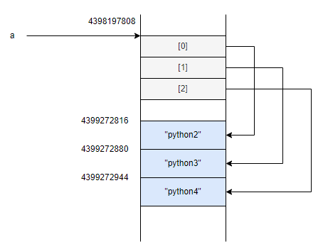
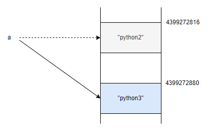

# [초보자를 위한 파이썬 300제](https://wikidocs.net/7014) 

## 1. 파이썬 시작하기 001 ~ 010

```python
#1
print('Hello World')
#2
print('Mary\'s cosmetics')
#3
print('신씨가 소리질렀다. "도둑이야".')
#4
print('"C:\\Windows"')	#\W가 의미를 가지지 않기때문에 하나만 적어도 된다.
#5
print("안녕하세요.\n만나서\t\t반갑습니다.")	#\n은 줄바꿈 \t는 탭
#6
print ("오늘은", "일요일")	#오늘은 일요일
#7
print('naver', 'kakao', 'sk', 'samsung', sep=';')	#naver;kakao;sk;samsung
#8
print('naver', 'kakao', 'sk', 'samsung', sep='/')	#naver/kakao/sk/samsung
#9
print('first', end='')
print('second')			#firstsecond
#10
print(5/3)
```

## 2. 파이썬 변수 011 ~ 020

```python
#11
삼성전자 = 50000			#한글로도 변수명 만들수는 있다. 일반적으로는 안씀.
보유주 = 10
총평가금액 = 삼성전자 * 보유주
print(총평가금액)
#12
시가총액 = 298000000000000	#구체적인 값 할당하는 과정 = 바인딩
현재가 = 50000
PER = 15.79
#13
s = 'hello'
t = 'python'
print(s + '! ' + t)			#hello! python
#14
print(2 + 2 * 3)			#8. 우선순위에 따라 *부터 연산
#15
a = '132'
print(type(a))				#string
#16
num_str = '720'				#정수형으로 변환
print(int(num_str))
#17
num = 100					#문자열로 변환
print(str(num))
#18
num_str = '15.79'			#실수(float) 타입으로 변환
print(float(num_str))
#19
year = '2020'				#최근 3년 연도 출력
year = int(year)
print(year-3, year-2, year-1)
#20
ac_month = 48584
no_interest = 36
total_pay = ac_month * no_interest
print(total_pay)
```

## 3. 파이썬 문자열 021~030

```python
#21
letters = 'python'
print(letters[0], letters[2])	#p t
#22
license_plate = "24가 2210"
print(license_plate[-4:])		#시작 인덱스를 생락하면 0. 끝 인덱스를 생략하면 문자열의 끝.
#23
string = '홀짝홀짝홀짝'			#홀만 출력. 슬라이싱으로 2칸씩 뛰어 출력
print(string[::2])
#24
string = 'PYTHON'				#반대로 출력
print(string[::-1])
#25
phone_number = "010-1111-2222"	#-제거하고 출력. - 대신에 띄어쓰기 쓸게요~
print(phone_number.replace('-',' '))
#26
phone_number = "010-1111-2222"	#전화번호 모두 붙여 출력
print(phone_number.replace('-',''))
#27
url = "http://sharebook.kr"		#도메인(kr) 출력
url_split = url.split('.')		#.을 기준으로 나누면 마지막 요소가 도메인.
print(url_split[-1])
#28
lang = 'python'					
lang[0] = 'P'
print(lang)						#문자열은 immutable하므로 error가 뜬다.
								#TypeError: 'str' object does not support item assignment
#29
string = 'abcdfe2a354a32a'		#'a'를 'A'로 변경
print(string.replace('a', 'A'))
#30
string = 'abcd'
string.replace('b', 'B')		#문자열은 변경x. replace 메서드 사용하면 원본은 그대로 두고 새로운 문자열 객체 리턴
print(string)					#abcd
'''
>>> x = [1,2,3]	#리스트 객체는 [0]번, [1]번, [2]번이 리스트의 원소인 문자열 객체를 다시 바인딩하는 구조. 
				#따라서 리스트에 원소를 추가하거나 삭제해도 리스트 객체의 시작 주소는 변하지 x
>>> y = x
>>> y += [4,]
>>> x
[1,2,3,4]
>>> y
[1,2,3,4]
'''
```

|      | mutable                                                      | immutable                                                    |
| ---- | ------------------------------------------------------------ | ------------------------------------------------------------ |
| 의미 | 수정 가능한 객체                                             | 수정 불가능한 객체                                           |
| 타입 | list, dict, set                                              | int, float, str, tuple                                       |
|      | a라는 변수는 리스트 객체를 바인딩한다. 리스트에 값을 추가해도 리스트 객체의 시작 주소 값은 변하지 않음. | 문자열 객체는 수정 불가능하기 때문에 기존 객체는 그대로 있고 새로운 문자열 객체가 생성됨. 변수가 새로 생성된 문자열 객체를 바인딩하게 되면 기존 문자열 객체는 가비지 컬렉터에 의해 자동으로 소멸됨. |
|      |  |  |

## 4. 파이썬 문자열 031~040

```python
#31
a = "3"
b = "4"
print(a + b)	#34

#32
print("Hi" * 3)	#HiHiHi

#33 화면에 '-' 80개 출력
print('-' * 80)

#34
t1 = 'python'
t2 = 'java'
print((t1 + ' ' + t2 + ' ')*4)

#35
name1 = "김민수" 
age1 = 10
name2 = "이철희"
age2 = 13
print('이름: %s 나이: %d' %(name1, age1))
print('이름: %s 나이: %d' %(name2, age2))

#36
name1 = "김민수" 
age1 = 10
name2 = "이철희"
age2 = 13
print('이름: {} 나이: {}'.format(name1, age1))
print('이름: {} 나이: {}'.format(name2, age2))

#37
name1 = "김민수" 
age1 = 10
name2 = "이철희"
age2 = 13
print(f'이름: {name1} 나이: {age1}' %(name1, age1))
print(f'이름: {name2} 나이: {age2}' %(name2, age2))

#38
상장주식수 = "5,969,782,550"
print(int(상장주식수.replace(',','')))

#39
분기 = "2020/03(E) (IFRS연결)"
print(분기[:7])

#40
data = "   삼성전자    "
print(data.strip())
```
## 4. 파이썬 문자열 041~050

```python
#41
ticker = "btc_krw"
ticker.upper()
print(ticker)

#42
ticker = "BTC_KRW"
ticker.lower()
print(ticker)

#43
print('hello'.capitalize())

#44
file_name = "보고서.xlsx"
file_name.endswith('xlsx')

#45 문자열이 xlsx나 xls로 끝나는지 확인
file_name = "보고서.xlsx"
b = file_name.endswith(("xlsx", "xls"))

#46
file_name = "2020_보고서.xlsx"
file_name.startswith('2020')

#47 공백을 기준으로 나누기
a = "hello world"
a.split()

#48
ticker = "btc_krw"
ticker.split('_')

#49
date = "2020-05-01"
date.split('-') 

#50
data = "039490     "
data.rstrip()
```

## 5. 파이썬 리스트 051~060

```python
#51
movie_rank = ['닥터 스트레인지', '스플릿', '럭키']

#52
movie_rank.append('배트맨')

#53 원하는 인덱스에 요소 추가
movie_rank.insert(1, '슈퍼맨')

#54
del movie_rank[3]

#55
del movie_rank[3]
del movie_rank[2]

#56
lang1 = ["C", "C++", "JAVA"]
lang2 = ["Python", "Go", "C#"]
langs = lang1 + lang2

#57
nums = [1, 2, 3, 4, 5, 6, 7]
print('max:',max(nums))
print('min:',min(nums))

#58
nums = [1, 2, 3, 4, 5]
print(sum(nums))

#59
cook = ["피자", "김밥", "만두", "양념치킨", "족발", "피자", "김치만두", "쫄면", "소시지", "라면", "팥빙수", "김치전"]
print(len(cook))

#60
nums = [1, 2, 3, 4, 5]
print(sum(nums)/len(nums))
```

## 6. 파이썬 리스트 061~070

```python
#61
price = ['20180728', 100, 130, 140, 150, 160, 170]
print(price[1:])

#62 홀수만
nums = [1, 2, 3, 4, 5, 6, 7, 8, 9, 10]
print(nums[::2])

#63 짝수만
nums = [1, 2, 3, 4, 5, 6, 7, 8, 9, 10]
print(nums[1::2])

#64 역방향
nums = [1, 2, 3, 4, 5]
print(nums[::-1])

#65
interest = ['삼성전자', 'LG전자', 'Naver']
print(interest[0], interest[2])

#66
interest = ['삼성전자', 'LG전자', 'Naver', 'SK하이닉스', '미래에셋대우']
print(' '.join(interest))

#67
interest = ['삼성전자', 'LG전자', 'Naver', 'SK하이닉스', '미래에셋대우']
print('/'.join(interest))

#68
interest = ['삼성전자', 'LG전자', 'Naver', 'SK하이닉스', '미래에셋대우']
print('\n'.join(interest))

#69
string = "삼성전자/LG전자/Naver"
print(string.split('/'))

#70
data = [2, 4, 3, 1, 5, 10, 9]
data.sort()
print(data)
```

## 7.  파이썬 튜플 071~080

```python
#71 
my_variable = ()

#72
movie_rank = ('닥터 스트레인지', '스플릿', '럭키')

#73 숫자 1이 저장된 튜플. (!)로 저장시키면 정수형으로 인식
my_tuple = (1,)

#74
t = (1, 2, 3)
t[0] = 'a'
'''
Traceback (most recent call last):
  File "<pyshell#46>", line 1, in <module>
    t[0] = 'a'
TypeError: 'tuple' object does not support item assignment
'''
#튜플은 immutable하기 때문에 원소의 값을 변경할 수 없다.

#75
t = 1, 2, 3, 4
#튜플. 원칙적으로 튜플은 괄호와 함께 데이터를 정의해야 하지만, 사용자 편의를 위해 괄호 없이도 동작함

#76 t가 ('A', 'b', 'c') 튜플을 가리키도록 수정 하라.
t = ('a', 'b', 'c')
t = ('A', 'b', 'c')

#77
interest = ('삼성전자', 'LG전자', 'SK Hynix')
interest_lst = list(interest)

#78
interest = ['삼성전자', 'LG전자', 'SK Hynix']
interest_tuple = tuple(interest)

#79
temp = ('apple', 'banana', 'cake')
a, b, c = temp
print(a, b, c)	#apple, banana, cake

#80
my_tuple = tuple(range(2, 100, 2))
```

## 8. 파이썬 딕셔너리

```python
#81 *좌측 8개의 값 변수에 바인딩
scores = [8.8, 8.9, 8.7, 9.2, 9.3, 9.7, 9.9, 9.5, 7.8, 9.4]
*valid_score, _, _= scores

#82 우측 8개 값 변수에 바인딩
scores = [8.8, 8.9, 8.7, 9.2, 9.3, 9.7, 9.9, 9.5, 7.8, 9.4]
_, _, *valid_score = scores

#83 가운데 8개의 값 변수에 바인딩
scores = [8.8, 8.9, 8.7, 9.2, 9.3, 9.7, 9.9, 9.5, 7.8, 9.4]
_, *valid_scores, _ = scores

#84 빈 딕셔너리 만들기
temp={ }

#85
icecream = {"메로나": 1000, "폴라포": 1200, "빵빠레": 1800}

#86 요소 추가
icecream["죠스바"] = 1200
icecream["월드콘"] = 1500

#87
ice = {'메로나': 1000,
       '폴로포': 1200,
       '빵빠레': 1800,
       '죠스바': 1200,
       '월드콘': 1500}
print(ice["메로나"])

#88 딕셔너리에서 밸류 값 수정
ice["메로나"] = 1300

#89  요소 삭제
del ice["메로나"]

#90 에러 발생 원인
>> icecream = {'폴라포': 1200, '빵빠레': 1800, '월드콘': 1500, '메로나': 1000}
>> icecream['누가바']
Traceback (most recent call last):
  File "<pyshell#69>", line 1, in <module>
    icecream['누가바']
KeyError: '누가바'
#icecream 딕셔너리의 키에는 누가바가 존재하지 않아서 KeyError 발생
```

